# Network Devices - Hubs, Bridges, Switches, and Routers

> [!abstract]- Table of Contents
> - [[#High-Level Terms]]
> - [[#Infrastructure Devices]]
>   - [[#Repeaters (Layer 1 - Physical)]]
>   - [[#Hubs (Layer 1 - Physical)]]
>   - [[#Bridges (Layer 2 - Data Link)]]
>   - [[#Switches (Layer 2 - Data Link, sometimes Layer 3)]]
>   - [[#Routers (Layer 3 - Network)]]
> - [[#The Complete Progression Summary]]
> - [[#Network Device Evolution]]
> - [[#Glossary of Technical Terms]]

---

## High-Level Terms

> [!info] Host
> Any device that's an endpoint on a network - generates or consumes data. Has an IP address.
>
> **Examples**: laptop, phone, server, printer, IoT device

> [!info] Client
> A host that initiates requests for services/resources.
>
> **Example**: Your web browser is a client

> [!info] Server
> A host that provides services/resources in response to requests.
>
> **Examples**: web server, file server, database server

> [!info] Network
> The infrastructure connecting hosts so they can communicate. Includes the cables, wireless signals, and all the devices that move data around.


---

## Infrastructure Devices

### Repeaters (Layer 1 - Physical)

**What they do**: Receive electrical/optical signals and regenerate them to extend range. That's it. No intelligence whatsoever.

**How they work - The complete picture**:

1. **Signal reception**: Electrical signal arrives on input port (could be degraded, weakened, or noisy from traveling over copper)
2. **Signal regeneration**: The repeater amplifies the signal back to full strength and cleans up the waveform
3. **Signal retransmission**: Sends the regenerated signal out the output port
4. **No data inspection**: The repeater has no concept of frames, packets, addresses, or protocols - it only sees electrical voltages/pulses


**Why they exist**: Ethernet has physical distance limitations due to signal attenuation (weakening) and timing constraints. For example:

- **10BASE-T**: 100 meters max (10Mbps)
- **100BASE-TX**: 100 meters max (100Mbps)
- **1000BASE-T**: 100 meters max (1000Mbps)

If you need to run cable further than this, signal quality degrades to the point where receiving devices can't interpret the data correctly. Repeaters let you chain segments together.

**Real-world example**:


> [!info] Distance Extension
> Without the repeater, Computer A couldn't reliably communicate with Computer B at 200m distance.

**Significance**: Let you extend cable runs beyond physical limitations.

**Limitations**:

- **Propagate everything**: ALL signals pass through, including errors, noise, and collisions
- **No collision domain segmentation**: Both sides of the repeater are in the same collision domain
- **Can't filter**: No ability to block or route traffic
- **No bandwidth management**: Can't prioritise or control traffic flow
- **Timing issues**: Adding repeaters adds propagation delay, which can cause timing problems in large networks
- **Limited cascading**: Standards limit how many repeaters you can chain (e.g., 5-4-3 rule for 10BASE-T: 5 segments, 4 repeaters, 3 populated segments)

**Liabilities**:

- If there's a bad/noisy device on one side, the repeater happily amplifies that garbage to the other side
- A broadcast storm on one side propagates to the other side
- One malfunctioning NIC sending junk can affect the entire extended network

---

### Hubs (Layer 1 - Physical)

**What they do**: Multi-port repeaters. Receive signal on one port, blast it out ALL other ports simultaneously.


**How they work - The complete picture**:

1. **Signal arrival**: Electrical signal (representing a frame) arrives on port 3
2. **Signal detection**: Hub detects electrical activity on that port
3. **Broadcasting**: Hub regenerates the signal and simultaneously transmits it out ALL other ports (1, 2, 4, 5, 6, etc.) - everything EXCEPT the source port
4. **No intelligence**: Hub is completely oblivious to:
    - MAC addresses (doesn't know who should receive the frame)
    - Frame contents (doesn't examine headers or data)
    - Frame errors (forwards corrupted frames just like good ones)
    - Network protocols (doesn't understand IP, TCP, etc.)

**Physical behavior**: When the hub receives bits on one port, it's literally creating the same electrical signal pattern on all other ports simultaneously. All devices connected to the hub are essentially on the same wire electrically.

**The collision domain problem explained**:

Because all ports share the same electrical medium (logically), only ONE device can transmit at a time. Here's what happens with simultaneous transmissions:


This is **CSMA/CD (Carrier Sense Multiple Access with Collision Detection)**:

- **Carrier Sense**: Listen before transmitting ("is the wire quiet?")
- **Multiple Access**: All devices share the same medium
- **Collision Detection**: Detect when two transmit simultaneously and handle it

**Bandwidth sharing explained**:

If you have a 100Mbps hub with 8 computers:

- The 100Mbps is the total capacity of the shared medium
- All 8 computers compete for that 100Mbps
- If one computer is transferring a large file, it might use 60Mbps
- The other 7 computers share the remaining 40Mbps
- More active devices = more collisions = lower effective throughput
- Realistically, you might only get 40-60% efficiency due to collisions and overhead

**Half-duplex operation**:

- Devices can send OR receive, but NOT both simultaneously
- The same wires are used for both transmit and receive
- When transmitting, the device must monitor for collisions

**Security implications**:

Because every frame goes to every port, every computer sees every other computer's traffic:


> [!danger] Security Risk
> A device in "promiscuous mode" can capture and read all this traffic. This is how password sniffing works on hub-based networks.

**Significance**: Cheap way to connect multiple devices. That's about it. They're essentially obsolete now.

**Limitations**:

- **Half-duplex only**: Can't send and receive simultaneously
- **Shared bandwidth**: 100Mbps hub with 8 ports = all 8 ports share that 100Mbps
- **No intelligence**: Can't filter traffic, can't learn addresses, can't make forwarding decisions
- **Single collision domain**: All devices compete for the medium; more devices = more collisions = worse performance
- **Security nightmare**: Every device can see every other device's traffic (promiscuous mode = password sniffing)
- **Broadcast storms**: No protection against broadcast loops - if you accidentally create a loop, it melts down instantly
- **No flow control**: Can't manage or prioritise traffic
- **Performance degradation**: Gets exponentially worse as you add devices

**Liabilities**:

- Performance degrades badly as you add devices (non-linear degradation)
- One chatty/broken/malicious device can tank the entire network
- Zero security - everything is visible to everyone
- Can't connect different network types or speeds effectively
- Vulnerable to denial-of-service (one device can monopolise bandwidth)

---

### Bridges (Layer 2 - Data Link)

**What they do**: Connect two network segments and intelligently forward frames between them based on MAC addresses. They make forwarding decisions to reduce unnecessary traffic.

**How they work - The complete picture**:

**Phase 1: Learning (building the MAC address table)**

When the bridge powers on, its MAC address table is empty. It learns by observing traffic:


**MAC Address Table now contains:**

| MAC Address           | Port |
|-----------------------|------|
| AA:AA:AA:AA:AA:AA    | 1    |
| BB:BB:BB:BB:BB:BB    | 2    |
| CC:CC:CC:CC:CC:CC    | 1    |

**Phase 2: Forwarding decisions (using the table)**

When a frame arrives, the bridge makes one of three decisions:

> [!example]- Decision 1: Filter (don't forward)
> **Scenario**: Frame arrives on Port 1
> - **Source MAC**: AA:AA:AA:AA:AA:AA (on Port 1)
> - **Destination MAC**: CC:CC:CC:CC:CC:CC
>
> **Bridge Logic**:
> - Checks table: CC:CC:CC:CC:CC:CC is on Port 1
> - Decision: Both source and destination are on the SAME segment
> - **Action**: ❌ DROP the frame (don't forward to Port 2)
> - **Reason**: The devices can communicate directly; no need to forward

> [!example]- Decision 2: Forward (send to specific port)
> **Scenario**: Frame arrives on Port 1
> - **Source MAC**: AA:AA:AA:AA:AA:AA (on Port 1)
> - **Destination MAC**: BB:BB:BB:BB:BB:BB
>
> **Bridge Logic**:
> - Checks table: BB:BB:BB:BB:BB:BB is on Port 2
> - Decision: Destination is on a DIFFERENT segment
> - **Action**: ✅ FORWARD the frame to Port 2 only
> - **Reason**: Port 2 is the only segment where the destination exists

> [!example]- Decision 3: Flood (send to all ports except source)
> **Scenario**: Frame arrives on Port 1
> - **Source MAC**: AA:AA:AA:AA:AA:AA (on Port 1)
> - **Destination MAC**: DD:DD:DD:DD:DD:DD
>
> **Bridge Logic**:
> - Checks table: DD:DD:DD:DD:DD:DD not found
> - Decision: Unknown destination
> - **Action**: 📢 FLOOD to all ports except Port 1
> - **Reason**: Don't know where the destination is, so send everywhere

> [!example]- Special Case: Broadcast Frames
> **Scenario**: Frame arrives on Port 1
> - **Destination MAC**: FF:FF:FF:FF:FF:FF (broadcast)
>
> **Bridge Logic**:
> - **Action**: 📢 ALWAYS flood to all ports except source
> - **Reason**: Broadcasts are meant for everyone by definition

**Aging out entries**:

MAC table entries aren't permanent. Each entry has a timer (typically 300 seconds / 5 minutes):

- When a frame is seen from that MAC, the timer resets
- If no frames from that MAC for 5 minutes, the entry is deleted
- This handles devices that disconnect or move to different ports

**Detailed example scenario**:

```
Segment A (Port 1):        Segment B (Port 2):
[Computer A: MAC aa:aa]    [Computer C: MAC cc:cc]
[Computer B: MAC bb:bb]    [Computer D: MAC dd:dd]
        |                          |
        +---------[Bridge]---------+
```

**Scenario 1**: Computer A (aa:aa) sends to Computer B (bb:bb)

1. Frame arrives at bridge on Port 1
2. Bridge learns: "aa:aa is on Port 1" (or refreshes timer)
3. Bridge checks destination: bb:bb
4. Bridge checks table: bb:bb is on Port 1
5. Decision: Source and destination both on Port 1 - FILTER
6. Result: Frame never reaches Segment B (reduces traffic on Segment B)

**Scenario 2**: Computer A (aa:aa) sends to Computer C (cc:cc)

1. Frame arrives at bridge on Port 1
2. Bridge learns: "aa:aa is on Port 1"
3. Bridge checks destination: cc:cc
4. Bridge checks table: cc:cc is on Port 2
5. Decision: Different segments - FORWARD to Port 2
6. Result: Only Computer C and D see this frame (not Computer B)

**Scenario 3**: Computer A sends to unknown MAC ee:ee

1. Frame arrives at bridge on Port 1
2. Bridge checks destination: ee:ee
3. Bridge checks table: ee:ee not found
4. Decision: FLOOD to all ports except Port 1
5. Result: Computers C and D receive the frame
6. If ee:ee exists and replies, bridge learns its location for next time

**Collision domain segmentation explained**:

This is a critical improvement over hubs:

**With a hub:**


> [!warning] Hub Limitation
> Only one device can transmit at a time across the entire network

**With bridges:**


> [!success] Bridge Improvement
> **TWO collision domains:**
> - A, B, C share one collision domain
> - D, E, F share a separate collision domain
> - A and D can transmit SIMULTANEOUSLY without collision

**Significance**:

- **Segments collision domains**: Each side of the bridge is its own collision domain - dramatically improves performance
- **Reduces traffic**: Only forwards when necessary, filtering local traffic
- **Transparent operation**: Hosts don't know the bridge exists, no configuration needed
- **Can connect different physical media**: Can bridge between Ethernet types (coax to twisted pair, fiber to copper) as long as they use the same Layer 2 protocol
- **Intelligent learning**: Automatically discovers network topology without manual configuration

**Limitations**:

- **Still floods unknowns and broadcasts**: If it doesn't know where a MAC is, or it's a broadcast, it floods all ports (same as a hub for these cases)
- **Limited ports**: Typically just 2-4 ports (though this is more historical - modern switches are multi-port bridges)
- **Software-based forwarding** (in early bridges): Decision-making happened in software, which was slower than hub's simple electrical repeating
- **Spanning Tree Protocol complexity**: Multiple bridges can create loops; need STP to prevent broadcast storms (more on this later)
- **Single broadcast domain**: All connected segments still share broadcasts - a broadcast on Segment A reaches Segment B
- **Store-and-forward delay**: Bridge must receive entire frame before forwarding (unlike hub's immediate repeating)

**Liabilities**:

- **Broadcast storms if loops exist**: If you connect two bridge ports together (creating a loop), broadcasts will circulate infinitely and crash the network within seconds
- **Can be overwhelmed by high traffic volumes**: Software-based processing has limits
- **MAC table overflow attacks**: An attacker can send frames with thousands of fake source MACs, filling the bridge's table. Once full, bridge degrades to hub behavior (floods everything)
- **No broadcast control**: Can't reduce or manage broadcast traffic
- **Spanning Tree Protocol vulnerabilities**: STP can be exploited by attackers

---

### Switches (Layer 2 - Data Link, sometimes Layer 3)

**What they do**: Multi-port bridges implemented in hardware with ASIC chips. Each port is its own collision domain. Make forwarding decisions at wire speed.

**How they work - The complete picture**:

Switches operate on the same fundamental principles as bridges (MAC learning, filtering, forwarding, flooding), but with critical improvements:

**Hardware-based forwarding with ASICs**:

**Early bridges - Software-based (SLOW):**


> [!warning] Software Bottleneck
> **Bottleneck**: CPU processing, software overhead
> **Speed**: 1,000-10,000 frames/second

**Modern switches - ASIC-based (FAST):**


> [!success] Hardware Acceleration
> **Bottleneck**: None - line rate forwarding
> **Speed**: Millions of frames/second per port

**CAM table (Content Addressable Memory)**:

Unlike regular RAM where you provide an address and get data back, CAM works in reverse:

> [!tip] CAM vs RAM
> **Traditional RAM** (Sequential Search):
> - Input: Memory address → Output: Data
> - "What's at memory address 1000?" → Returns: "AA:AA:AA:AA:AA:AA"
> - Searches one entry at a time
>
> **CAM** (Parallel Search):
> - Input: Data → Output: Location
> - "Where is AA:AA:AA:AA:AA:AA?" → Returns: "Port 7"
> - Searches ALL entries simultaneously
> - Lookups in nanoseconds ⚡


**The microsegmentation revolution**:

This is the game-changing feature of switches. Let's compare in detail:

**Hub scenario (8 computers, 100Mbps hub)**:


> [!warning] Hub Performance
> **Performance reality:**
> - Only one conversation at a time across entire hub
> - With 50% efficiency: ~50Mbps total throughput
> - Each computer effectively gets ~6.25Mbps on average
> - Heavy traffic from one computer degrades performance for everyone

**Switch scenario (8 computers, 100Mbps switch)**:


> [!success] Switch Performance
> **Performance reality:**
> - Multiple simultaneous conversations
> - Full-duplex: 100Mbps send + 100Mbps receive per port = 200Mbps per port
> - Total switching capacity: 1,600Mbps (8 ports × 200Mbps)
> - Heavy traffic from Computer 1 doesn't affect others at all
> - Each computer gets dedicated 100Mbps, regardless of network load

**Full-duplex operation explained**:

**Half-duplex (hub):**


> [!warning] Half-Duplex Limitations
> - Can send OR receive, not both
> - Must monitor for collisions
> - Shared medium

**Full-duplex (switch):**


> [!success] Full-Duplex Advantages
> - Separate transmit and receive circuits
> - No possibility of collision (point-to-point)
> - Can send and receive simultaneously at full speed
> - 100Mbps becomes 200Mbps total (100 each direction)

**Practical example of microsegmentation benefit**:

Scenario: Office with 20 computers doing various tasks

With a 100Mbps hub:

- Computer 1 downloading a 1GB file from Server (uses ~80Mbps)
- Computers 2-20 share remaining ~20Mbps
- Computer 5 trying to video conference: laggy, choppy (needs consistent bandwidth)
- Computer 10 trying to browse web: slow page loads (waiting for hub access)
- Total effective throughput: ~40-50Mbps (due to collisions and contention)

With a 100Mbps switch:

- Computer 1 downloading from Server: dedicated 100Mbps (doesn't affect others)
- Computer 5 video conferencing: dedicated 100Mbps (smooth, consistent)
- Computer 10 browsing: dedicated 100Mbps (instant page loads)
- All 20 computers can use their full 100Mbps simultaneously
- Total effective throughput: Up to 2,000Mbps (20 × 100Mbps)

**Switch learning and forwarding (same as bridge, but faster)**:

1. **Learning**: Build CAM table by observing source MACs
2. **Forwarding**: Look up destination MAC in CAM table
3. **Filtering**: If source and destination on same port, drop
4. **Flooding**: If destination unknown or broadcast, send to all ports except source

**Switch types and features**:

| Feature                | Unmanaged Switch   | Managed Switch      | Layer 3 Switch         |
| ---------------------- | ------------------ | ------------------- | ---------------------- |
| **Configuration**      | None (plug & play) | Web/CLI interface   | Web/CLI interface      |
| **MAC Learning**       | ✅ Automatic        | ✅ Automatic         | ✅ Automatic            |
| **VLANs**              | ❌ No               | ✅ Yes               | ✅ Yes                  |
| **Port Mirroring**     | ❌ No               | ✅ Yes               | ✅ Yes                  |
| **QoS**                | ❌ No               | ✅ Yes               | ✅ Yes                  |
| **STP Control**        | ❌ No               | ✅ Yes               | ✅ Yes                  |
| **IP Routing**         | ❌ No               | ❌ No                | ✅ Yes                  |
| **Inter-VLAN Routing** | ❌ No               | ❌ No                | ✅ Yes                  |
| **Typical Use**        | Home/Small Office  | Business/Enterprise | Data Center/Enterprise |
| **Price Range**        | $20-100            | $100-1,000+         | $500-10,000+           |

> [!info]- Unmanaged Switches
> **Best for**: Home networks, small offices
> **Pros**:
> - Zero configuration needed
> - Very affordable
> - Simple to deploy
>
> **Cons**:
> - No security features
> - No traffic prioritization
> - No monitoring capabilities

> [!info]- Managed Switches
> **Best for**: Business networks, organizations
> **Key Features**:
> - **VLAN support** - Logical network segmentation
> - **Port mirroring** - Copy traffic for analysis
> - **QoS** - Prioritize important traffic
> - **SNMP** - Network monitoring and management
> - **Port security** - MAC address filtering
> - **Link aggregation** - Combine ports for higher bandwidth
> - **STP controls** - Prevent switching loops

> [!info]- Layer 3 Switches
> **Best for**: Data centers, large enterprise networks
> **Key Features**:
> - All Layer 2 managed switch features
> - **IP routing** between VLANs
> - Faster inter-VLAN routing than traditional routers
> - Maintains both routing table and CAM table
> - Hardware-accelerated routing decisions

**VLAN segmentation explained**:

VLANs (Virtual LANs) let you create multiple logical networks on one physical switch:


> [!tip] VLAN Benefits
> - Devices in VLAN 10 can't see broadcasts from VLAN 20
> - Security: Sales can't access Engineering traffic
> - Organization: Logical grouping without physical separation
> - Flexibility: Change a port's VLAN without rewiring

**Performance specifications**:

Modern switch performance metrics:

**Forwarding rate**: Measured in packets per second (pps) or Mpps

- Gigabit port at wire speed: ~1.488 Mpps (million packets per second)
    - Calculation: 1,000,000,000 bits/sec ÷ (64 byte minimum frame × 8 bits/byte + 20 bytes overhead) = 1,488,095 pps
- 24-port gigabit switch at line rate: ~35.7 Mpps total

**Switching capacity**: Total throughput in Gbps

- Non-blocking switch: Sum of all ports × 2 (full-duplex)
- 24-port gigabit switch: 24 × 1 Gbps × 2 = 48 Gbps switching capacity

**Latency**: Time from frame arrival to frame forwarding

- Cut-through switching: ~1-2 microseconds (starts forwarding as soon as destination MAC is read)
- Store-and-forward: ~10-15 microseconds (waits for entire frame before forwarding)

**Buffer memory**: Handles traffic bursts

- Small buffers: 128 KB - 256 KB per port
- Large buffers: 1 MB+ per port (better for storage networks)

**Significance**:

- **Full-duplex operation**: Each port can send AND receive simultaneously - eliminates collisions entirely
- **Dedicated bandwidth per port**: 100Mbps port = full 100Mbps for that device alone
- **Wire speed / line rate**: Hardware forwarding at maximum theoretical speed with zero bottlenecks
- **Scalability**: Can have 24, 48, 96+ ports in a single switch
- **VLANs**: Logical broadcast domain segmentation without physical rewiring
- **Advanced management**: Traffic control, monitoring, security features
- **Microsegmentation**: Every device gets isolated, dedicated bandwidth

**Limitations**:

- **Still Layer 2 for basic switches**: Can't route between different IP networks (need router or Layer 3 switch)
- **Single broadcast domain** (without VLANs): All ports share broadcast traffic
- **CAM table size**: Finite MAC address capacity (typically 8,000-128,000+ entries depending on switch)
- **STP convergence time**: Topology changes take 30-50 seconds with classic STP (faster with RSTP)
- **Cost vs. hubs**: More expensive than hubs (though price gap has essentially disappeared)
- **Power consumption**: Active electronics use more power than passive hubs
- **Configuration complexity**: Managed switches require knowledge to configure properly

**Liabilities**:

> [!bug]- Attack Vector: CAM Table Overflow
> **Attack**: Attacker floods thousands of fake source MACs, fills CAM table to capacity
> **Impact**: Once full, switch can't learn new MACs and degrades to hub behavior (floods all traffic)
> **Tool**: `macof`
> **Mitigation**: Port security, MAC address limits per port
>
> **Realism: ⚠️⚠️ MEDIUM**
> - **Reality**: Works on older/unmanaged switches, ineffective on modern enterprise gear
> - **Real-world**: Cheap office switches and home equipment vulnerable; enterprise switches have built-in protections
> - **Likelihood**: MEDIUM - depends heavily on switch quality and configuration
> - **Modern defense**: Most managed switches have port security enabled by default

> [!bug]- Attack Vector: VLAN Hopping
> **Attack**: Attacker exploits misconfigured trunk ports to access other VLANs
> **Impact**: Unauthorized access to isolated network segments
> **Method**: Double-tagging or switch spoofing
> **Mitigation**: Disable unused ports, explicit VLAN assignments, disable DTP
>
> **Realism: ⚠️ LOW-MEDIUM**
> - **Reality**: Requires specific misconfigurations (trunk ports on access layer, DTP enabled)
> - **Real-world**: Rare in well-managed networks, but surprisingly common in legacy/poorly configured environments
> - **Likelihood**: LOW-MEDIUM - network admin has to make specific mistakes
> - **Modern defense**: DTP disabled by default on newer switch firmware, best practices widely known

> [!bug]- Attack Vector: ARP Spoofing/Poisoning
> **Attack**: Attacker sends fake ARP responses claiming to be the gateway
> **Impact**: Man-in-the-middle - intercepting all traffic
> **Tool**: `arpspoof`, `ettercap`
> **Mitigation**: Dynamic ARP Inspection (DAI), static ARP entries for critical devices
>
> **Realism: ⚠️⚠️⚠️ HIGH**
> - **Reality**: Very common, trivially easy to execute with free tools
> - **Real-world**: Used constantly in pentests and actual attacks; works on most unprotected networks
> - **Likelihood**: HIGH - if you're on unsecured corporate WiFi or coffee shop network, this is a real threat
> - **Why it persists**: ARP has no authentication by design; DAI requires managed switches and is often not enabled
> - **Note**: This is probably the #1 most practical Layer 2 attack in 2025

> [!bug]- Attack Vector: Spanning Tree Attacks
> **Attack**: Rogue device claims to be root bridge
> **Impact**: Topology recalculation, potential network disruption or traffic interception
> **Mitigation**: BPDU Guard, Root Guard, enable PortFast on access ports only
>
> **Realism: ⚠️ LOW**
> - **Reality**: Theoretically possible but requires physical access to switch port
> - **Real-world**: Mitigated by default on most modern switches (BPDU Guard is standard practice)
> - **Likelihood**: LOW - mostly a legacy concern from early 2000s
> - **Modern defense**: Enterprise switches automatically enable BPDU Guard on access ports

> [!bug]- Attack Vector: DHCP Starvation
> **Attack**: Attacker requests all available DHCP addresses
> **Impact**: Legitimate devices can't get IP addresses, DoS condition
> **Tool**: `yersinia`, `dhcpstarv`
> **Mitigation**: DHCP Snooping, rate limiting, port security
>
> **Realism: ⚠️⚠️ MEDIUM**
> - **Reality**: Works but limited impact in many scenarios - mostly causes temporary disruption
> - **Real-world**: Easier targets exist for data theft; mainly useful for denial-of-service
> - **Likelihood**: MEDIUM - effective for disruption but not for credential harvesting
> - **Detection**: Usually detected quickly due to user complaints; logs show exhaustion

> [!bug]- Attack Vector: Broadcast Storm
> **Attack**: Switching loops cause exponential broadcast multiplication
> **Impact**: Network saturation, complete meltdown within seconds
> **Cause**: STP failure or misconfiguration
> **Mitigation**: Properly configured STP/RSTP, loop detection
>
> **Realism: ⚠️ LOW (for intentional attack), ⚠️⚠️ MEDIUM (for accident)**
> - **Reality**: Usually accidental (cable loops, wrong port connections) rather than intentional attack
> - **Real-world**: STP/RSTP prevents this automatically in properly configured networks
> - **Likelihood**: LOW for deliberate attack, MEDIUM for accidental occurrence
> - **Why rare as attack**: Easier to just unplug cables; more of an operational hazard than security threat

---

### Routers (Layer 3 - Network)

**What they do**: Connect different networks together and route packets between them based on IP addresses. They're the traffic directors that enable the internet to function.

**How they work - The complete picture**:

**Understanding the network boundary**:

First, understand what routers actually separate:


> [!note] Network Separation
> These networks are completely separate:
> - Different IP address ranges
> - Different broadcast domains
> - Can't communicate directly
> - Need routing to reach each other

**Detailed routing process - Step by step**:

**Scenario**: You're at home (192.168.1.100) and want to visit a website at 8.8.8.8

**Step 1: Your computer makes a routing decision**

Your computer's routing table (simplified):

```
Destination          Gateway          Interface
192.168.1.0/24      0.0.0.0          eth0 (local - directly connected)
0.0.0.0/0           192.168.1.1      eth0 (default route - everything else)
```

Your computer's logic:

- "I want to reach 8.8.8.8"
- "Is 8.8.8.8 in 192.168.1.0/24?" NO
- "Check default route (0.0.0.0/0)" - matches everything
- "Send to gateway 192.168.1.1" (your router)

**Step 2: Your computer needs the gateway's MAC address**

Your computer knows the IP (192.168.1.1) but needs the MAC address to send the frame:

```mermaid
sequenceDiagram
    participant C as Your Computer
    participant N as Network
    participant R as Router (192.168.1.1)

    Note over C: Check ARP cache - not found
    C->>N: Broadcast: "Who has 192.168.1.1?"
    R->>C: "I have 192.168.1.1, MAC: AA:BB:CC:DD:EE:FF"
    Note over C: Cache: 192.168.1.1 → AA:BB:CC:DD:EE:FF
```



**Step 3: Your computer builds and sends the frame**


> [!important] Key Concept - Encapsulation
> - **Layer 2 (Frame)**: Destination MAC is the **router** (gateway) ← Changes at each hop
> - **Layer 3 (Packet)**: Destination IP is the **final destination** (8.8.8.8) ← Stays the same
>
> Your computer sends the frame to the router, but the packet is destined for Google!

**Step 4: Frame travels to the router**

```
[Your Computer] ---eth0--- [Home Switch] ---eth1--- [Home Router LAN port]
```

Switch forwards the frame to the router based on destination MAC.

**Step 5: Router receives and processes the frame**

Router's LAN interface receives the frame:

1. **Layer 2 processing**:
    - "Destination MAC is me (AA:BB:CC:DD:EE:FF)" ✓
    - Remove Ethernet header, extract IP packet
2. **Layer 3 processing**:
    - Read destination IP: 8.8.8.8
    - "Is this IP for me?" NO
    - "Should I route this?" YES
    - Check routing table

**Step 6: Router consults routing table**

Router's routing table (simplified):

```
Destination          Gateway          Interface      Metric
192.168.1.0/24      0.0.0.0          eth0 (LAN)     0
0.0.0.0/0           203.0.113.1      eth1 (WAN)     1
```

Router's logic:

- "Destination is 8.8.8.8"
- "Is it in 192.168.1.0/24?" NO
- "Check default route (0.0.0.0/0)" MATCH
- "Forward to gateway 203.0.113.1 via eth1 (WAN interface)"

**Step 7: Router modifies the packet**

Before forwarding, the router modifies the IP packet:

```mermaid
graph LR
    subgraph Original Packet
    O[Source IP: 192.168.1.100<br/>Dest IP: 8.8.8.8<br/>TTL: 64]
    end

    O -->|Router Processing| R{Router<br/>Modifications}

    subgraph Modified Packet
    M[Source IP: 203.0.113.45 ← NAT<br/>Dest IP: 8.8.8.8 ← Unchanged<br/>TTL: 63 ← Decremented]
    end

    R --> M

    style O fill:#ffcccc,stroke:#333
    style R fill:#FFD700,stroke:#333,stroke-width:2px
    style M fill:#90EE90,stroke:#333
```

> [!note] Router Packet Modifications
> **1. TTL (Time To Live)**: Decremented by 1 (was 64, now 63)
> - Prevents infinite loops
> - When TTL reaches 0, packet is dropped
> - Router sends "ICMP Time Exceeded" back to source
>
> **2. Source IP via NAT**: Changed from private IP (192.168.1.100) to public IP (203.0.113.45)
> - Private IPs (192.168.x.x, 10.x.x.x, 172.16-31.x.x) aren't routable on internet
> - Router maintains NAT translation table to track connections
>
> **3. Checksum**: Recalculated because packet was modified

**Step 8: Router builds new frame for WAN**

```
New Ethernet Frame:
+-----------------+-------------------+----------+
| Dest MAC        | Source MAC        | Payload  |
| ISP Router MAC  | Your Router WAN   | IP Packet|
+-----------------+-------------------+----------+
```

Notice: Layer 2 addressing changes at each hop, but Layer 3 (IP addresses) stays the same (except NAT).

**Step 9: Packet travels through multiple routers to destination**

```mermaid
graph LR
    YR[Your Router<br/>TTL: 64→63] --> ISP1[ISP Router 1<br/>TTL: 63→62]
    ISP1 --> ISP2[ISP Router 2<br/>TTL: 62→61]
    ISP2 --> CORE[ISP Core<br/>TTL: 61→60]
    CORE --> BB[Backbone Router<br/>TTL: 60→59]
    BB --> GE[Google Edge<br/>TTL: 59→58]
    GE --> G[8.8.8.8<br/>Destination!]

    style YR fill:#FFD700,stroke:#333
    style ISP1 fill:#FFB6C1,stroke:#333
    style ISP2 fill:#FFB6C1,stroke:#333
    style CORE fill:#DDA0DD,stroke:#333
    style BB fill:#DDA0DD,stroke:#333
    style GE fill:#87CEEB,stroke:#333
    style G fill:#90EE90,stroke:#333,stroke-width:3px
```

> [!important] At EACH Router Hop
> 1. Frame is received and **decapsulated** (Layer 2 removed)
> 2. IP packet is **examined** (read destination IP)
> 3. **Routing table lookup** (where to forward?)
> 4. **TTL decremented** (prevent infinite loops)
> 5. **New frame is built** (new MAC addresses for next hop)
> 6. Packet **forwarded** to next hop
>
> This happens potentially **dozens of times** across the internet!

**Understanding NAT (Network Address Translation) in detail**:

Your home router maintains a NAT translation table:

| Internal Device | Internal Port | Public IP    | Public Port | Destination  |
|----------------|---------------|--------------|-------------|--------------|
| 192.168.1.100  | :50000        | 203.0.113.45 | :50000      | 8.8.8.8:80   |
| 192.168.1.101  | :50001        | 203.0.113.45 | :50001      | 1.2.3.4:443  |
| 192.168.1.100  | :50002        | 203.0.113.45 | :50002      | 9.9.9.9:443  |

```mermaid
sequenceDiagram
    participant C as Computer<br/>192.168.1.100:50000
    participant R as Router<br/>NAT Table
    participant I as Internet<br/>8.8.8.8:80

    Note over C,I: Outbound Traffic
    C->>R: From: 192.168.1.100:50000<br/>To: 8.8.8.8:80
    Note over R: Translate source to<br/>203.0.113.45:50000<br/>Record in NAT table
    R->>I: From: 203.0.113.45:50000<br/>To: 8.8.8.8:80

    Note over C,I: Inbound Response
    I->>R: From: 8.8.8.8:80<br/>To: 203.0.113.45:50000
    Note over R: Check NAT table<br/>Port 50000 → 192.168.1.100:50000
    R->>C: From: 8.8.8.8:80<br/>To: 192.168.1.100:50000
```

> [!note] NAT Purpose
> This is why multiple devices can share one public IP address.

**The gateway IP concept explained**:

Every device on a network needs to know its **default gateway** (the router's IP on that network):

```
Your computer's network configuration:
IP Address:      192.168.1.100
Subnet Mask:     255.255.255.0 (/24)
Default Gateway: 192.168.1.1        <-- This is the router
DNS Servers:     8.8.8.8, 8.8.4.4
```

The gateway is:

- The "exit point" from your local network
- Where you send packets destined for other networks
- Usually the router's interface IP on your network

**How the gateway is used**:

Your computer's routing decision logic:

```
if (destination_ip is in my_subnet):
    send directly to destination (use ARP to get MAC)
else:
    send to default_gateway (use ARP to get gateway MAC)
```

Example:

- Destination 192.168.1.50? Same subnet → send directly
- Destination 8.8.8.8? Different network → send to gateway (192.168.1.1)

**Multiple interfaces on a router**:

Routers have multiple network interfaces, each in a different network:

```mermaid
graph TD
    subgraph Network A - 192.168.1.0/24 - LAN
    D1[Your Computer<br/>192.168.1.100] --> E0
    D2[Your Phone<br/>192.168.1.101] --> E0
    D3[Your Laptop<br/>192.168.1.102] --> E0
    end

    E0[eth0 Interface<br/>IP: 192.168.1.1/24]

    E0 --> R{ROUTER}
    R --> E1[eth1 Interface<br/>IP: 203.0.113.45/24]

    subgraph Network B - 203.0.113.0/24 - WAN
    E1 --> ISP[ISP's Network<br/>Internet Gateway]
    end

    style R fill:#FFD700,stroke:#333,stroke-width:3px
    style E0 fill:#90EE90,stroke:#333,stroke-width:2px
    style E1 fill:#87CEEB,stroke:#333,stroke-width:2px
```

> [!note] Router Multi-Homing
> The router is **simultaneously** a member of multiple networks:
> - **Part of 192.168.1.0/24** (LAN) - Gateway for your devices
> - **Part of 203.0.113.0/24** (WAN) - Device on ISP's network
>
> Each interface has its own IP address in its respective network!

**Routing table explained in detail**:

A routing table contains:

1. **Destination network**: What IP range this route applies to
2. **Subnet mask/prefix**: How much of the IP identifies the network
3. **Gateway/Next hop**: Where to send packets for this destination
4. **Interface**: Which router interface to use
5. **Metric**: Cost/preference (lower is better)

Example routing table:

```
Destination      Mask            Gateway         Interface   Metric
192.168.1.0      255.255.255.0   0.0.0.0         eth0        0
10.5.0.0         255.255.0.0     0.0.0.0         eth2        0
0.0.0.0          0.0.0.0         203.0.113.1     eth1        1
```

Reading this:

- Row 1: 192.168.1.0/24 network is directly connected on eth0 (no gateway needed)
- Row 2: 10.5.0.0/16 network is directly connected on eth2 (no gateway needed)
- Row 3: Everything else (0.0.0.0/0 = default route) goes to 203.0.113.1 via eth1

**Routing decision process**:

```mermaid
graph TD
    P1[Packet arrives<br/>Dest: 10.5.0.50] --> C1{Match 192.168.1.0/24?}
    C1 -->|NO| C2{Match 10.5.0.0/16?}
    C2 -->|YES| D1[Gateway: 0.0.0.0<br/>Directly Connected]
    D1 --> F1[Forward out eth2<br/>to 10.5.0.50]

    P2[Packet arrives<br/>Dest: 8.8.8.8] --> C3{Match 192.168.1.0/24?}
    C3 -->|NO| C4{Match 10.5.0.0/16?}
    C4 -->|NO| C5{Match 0.0.0.0/0<br/>Default Route?}
    C5 -->|YES| D2[Gateway: 203.0.113.1]
    D2 --> F2[Forward to 203.0.113.1<br/>via eth1]

    style F1 fill:#90EE90,stroke:#333,stroke-width:2px
    style F2 fill:#90EE90,stroke:#333,stroke-width:2px
    style C2 fill:#FFD700,stroke:#333
    style C5 fill:#FFD700,stroke:#333
```

> [!tip] Longest Prefix Match
> Routers use **longest prefix match** - the most specific route wins!
> - 10.5.0.50 matches both 10.5.0.0/16 and 0.0.0.0/0
> - Router chooses 10.5.0.0/16 (more specific - 16 bits vs 0 bits)
> - Default route (0.0.0.0/0) only used when nothing else matches

**Dynamic routing protocols**:

Instead of manually configuring every route, routers can learn routes automatically:

```mermaid
graph TD
    subgraph OSPF - Interior Gateway Protocol
    O1[Router A] <-->|Share Topology| O2[Router B]
    O2 <-->|Link State Ads| O3[Router C]
    O3 <-->|Build Full Map| O1
    end

    subgraph BGP - Exterior Gateway Protocol
    B1[ISP 1<br/>AS 100] <-->|Path Vectors| B2[ISP 2<br/>AS 200]
    B2 <-->|Reachability| B3[ISP 3<br/>AS 300]
    B3 <-->|Policy Based| B1
    end

    style O1 fill:#90EE90,stroke:#333
    style O2 fill:#90EE90,stroke:#333
    style O3 fill:#90EE90,stroke:#333
    style B1 fill:#87CEEB,stroke:#333,stroke-width:2px
    style B2 fill:#87CEEB,stroke:#333,stroke-width:2px
    style B3 fill:#87CEEB,stroke:#333,stroke-width:2px
```

> [!info] OSPF (Open Shortest Path First)
> **Type**: Interior Gateway Protocol (IGP)
> **Use Case**: Within organizations
> **How it works**:
> - Routers share topology information with neighbors
> - Each router builds complete network map
> - Calculates shortest path using Dijkstra's algorithm
> - Automatically adapts when links fail
> - Fast convergence (seconds)

> [!info] BGP (Border Gateway Protocol)
> **Type**: Exterior Gateway Protocol (EGP)
> **Use Case**: Between different organizations/ISPs
> **How it works**:
> - Exchanges reachability information between Autonomous Systems (AS)
> - Path vector protocol (knows full path to destination)
> - Powers the entire internet routing infrastructure
> - Policy-based (not just shortest path)
> - Slower convergence but highly scalable

**Broadcast domain segmentation**:

Key difference from switches: routers block broadcasts

**Switch network (one broadcast domain):**

```mermaid
graph LR
    A[Computer A] & B[Computer B] & D[Computer D] --> S{Switch}
    S --> C[Computer C]
    S --> E[Computer E]
    style S fill:#90EE90,stroke:#333
```

> [!info] Switch Broadcast Behavior
> Computer A broadcasts → Computers B, C, D, E all receive it
> **One broadcast domain**

**Routed network (multiple broadcast domains):**

```mermaid
graph TD
    subgraph Broadcast Domain 1 - 192.168.1.0/24
    A[Computer A<br/>192.168.1.100]
    end

    A --> R{Router<br/>192.168.1.1<br/>10.0.0.1}

    subgraph Broadcast Domain 2 - 10.0.0.0/24
    R --> B[Computer B<br/>10.0.0.50]
    R --> C[Computer C<br/>10.0.0.75]
    end

    style R fill:#FFD700,stroke:#333,stroke-width:3px
```

> [!success] Router Broadcast Blocking
> Computer A broadcasts:
> - Stays in 192.168.1.0/24 network
> - Router does NOT forward to 10.0.0.0/24
> - Computers B and C never see it
> **Two broadcast domains**

**Types of routers**:

| Feature | Home/SOHO Router | Enterprise Router | Core/Backbone Router |
|---------|------------------|-------------------|---------------------|
| **Primary Function** | All-in-one device | Dedicated routing | Internet backbone |
| **Integrated Features** | Router, Switch, WiFi, Firewall, DHCP, DNS | Routing only | Routing only |
| **WAN Connections** | Single | Multiple (redundant) | Massive redundancy |
| **Routing Protocols** | Basic (static, RIP) | OSPF, EIGRP, BGP | Full BGP, MPLS |
| **Interface Speed** | 1Gbps | 1-10Gbps+ | 100-400Gbps+ per port |
| **Route Table Size** | Hundreds | Thousands | Millions (full BGP table) |
| **Hardware Encryption** | Basic/none | ✅ VPN acceleration | ✅ Carrier-grade |
| **Reliability** | Consumer-grade | Business-grade | Carrier-grade (99.999%) |
| **Examples** | Linksys, Netgear, TP-Link | Cisco ISR, Juniper MX | Cisco CRS, Juniper PTX |
| **Price Range** | $50-300 | $1,000-50,000+ | $100,000-1,000,000+ |

> [!info]- Home/SOHO Routers
> **Best for**: Home networks, small offices
> **All-in-one device includes**:
> - 🔀 Router (connects LAN to WAN)
> - 🔌 Switch (4-8 port switch for LAN devices)
> - 📡 Wireless access point (WiFi)
> - 🛡️ Firewall (blocks unwanted incoming connections)
> - 📋 DHCP server (assigns IPs to devices)
> - 🔍 DNS forwarder (forwards DNS queries)
>
> **Typical specs**: 1Gbps WAN, 4-port 1Gbps switch, WiFi 5/6

> [!info]- Enterprise Routers
> **Best for**: Business networks, branch offices, data centers
> **Key capabilities**:
> - Multiple WAN connections for redundancy and load balancing
> - Advanced routing protocols (OSPF, EIGRP, BGP)
> - Hardware-accelerated VPN encryption
> - QoS and traffic shaping
> - High availability features (VRRP, HSRP)
> - Detailed logging and monitoring
>
> **Typical specs**: 10Gbps+ interfaces, handle 10,000+ routes

> [!info]- Core/Backbone Routers
> **Best for**: ISP core networks, internet backbone, data center interconnects
> **Mission-critical features**:
> - Massive throughput (100-400Gbps+ per port)
> - Handle full internet routing table (millions of routes)
> - Sub-millisecond failover
> - Carrier-grade reliability (99.999% uptime)
> - Advanced traffic engineering
> - MPLS support for service provider features
>
> **Typical specs**: Petabit switching capacity, full BGP table (~900K routes)

**Significance**:

- **Connects different networks**: Essential for internet functionality
- **Segments broadcast domains**: Each interface is separate broadcast domain (reduces broadcast traffic)
- **Security boundary**: Can filter traffic between networks (firewall rules)
- **NAT functionality**: Allows many devices to share one public IP
- **Path selection**: Chooses best route among multiple paths
- **Traffic management**: QoS, bandwidth control, prioritization
- **Gateway services**: Often provides DHCP, DNS, VPN

**Limitations**:

- **Slower than switches** (traditionally): More processing required (though modern routers are very fast)
- **More expensive**: Generally cost more than comparable switches
- **More complex configuration**: Requires understanding of IP addressing, subnetting, routing protocols
- **Potential routing loops**: Misconfigured routes can create loops (mitigated by TTL and routing protocols)
- **Broadcast blocking**: Blocks broadcasts by design, which breaks protocols that rely on broadcast (though usually intentional)
- **NAT complications**: Can break certain protocols, makes incoming connections difficult without port forwarding

**Liabilities**:

> [!bug]- Attack Vector: Single Point of Failure
> **Risk**: If your only router dies, you lose connectivity to other networks/internet
> **Impact**: Complete network isolation, business downtime
> **Mitigation**: Redundant routers with VRRP/HSRP, multiple ISP connections
>
> **Realism: ⚠️⚠️⚠️ HIGH (Infrastructure Risk)**
> - **Reality**: Not an attack per se, but critical infrastructure risk
> - **Real-world**: Small businesses often have single router; enterprises always have redundancy
> - **Likelihood**: HIGH for SMB, LOW for enterprise
> - **Business impact**: Can cause complete business stoppage for hours/days

> [!bug]- Attack Vector: Routing Table Poisoning
> **Attack**: Malicious routing updates can redirect traffic to attacker
> **Impact**: Traffic interception, man-in-the-middle attacks
> **Method**: Compromised routing protocols (RIP, OSPF)
> **Mitigation**: Routing protocol authentication, route filtering, BGP prefix validation
>
> **Realism: ⚠️⚠️ MEDIUM**
> - **Reality**: Requires access to internal routing infrastructure or compromised router
> - **Real-world**: Mostly internal threat; external attacker needs to breach perimeter first
> - **Likelihood**: MEDIUM - requires significant access, but devastating if successful
> - **Modern defense**: MD5/SHA authentication on routing protocols is standard practice

> [!bug]- Attack Vector: BGP Hijacking
> **Attack**: Attacker announces false routes, redirecting internet traffic through their systems
> **Impact**: Massive traffic interception, service disruption
> **Famous incidents**: YouTube hijack (2008), Cloudflare route leak (2019)
> **Mitigation**: RPKI (Resource Public Key Infrastructure), BGP route filtering, IRR validation
>
> **Realism: ⚠️⚠️⚠️ HIGH (at ISP/Nation-State level)**
> - **Reality**: Happens regularly, sometimes accidental, sometimes malicious
> - **Real-world**: Documented cases every year; used by nation-states for surveillance/censorship
> - **Likelihood**: HIGH at ISP scale, ZERO for individual/corporate attackers (requires AS ownership)
> - **Modern defense**: RPKI adoption growing but still under 50% globally as of 2025
> - **Note**: This is an internet-scale problem, not a local network concern

> [!bug]- Attack Vector: ACL Misconfiguration
> **Risk**: Firewall rules can accidentally block legitimate traffic or allow malicious traffic
> **Impact**: Service disruption or security breach
> **Common mistakes**: Permissive rules, wrong rule order, missing deny-all at end
> **Mitigation**: Regular ACL audits, testing before deployment, documentation
>
> **Realism: ⚠️⚠️⚠️ HIGH**
> - **Reality**: Human error is the most common security vulnerability
> - **Real-world**: ACL misconfigurations discovered in nearly every network audit
> - **Likelihood**: HIGH - complex rule sets are error-prone, especially after years of changes
> - **Common scenarios**: "any any permit" rules left from testing, overly broad /16 allows, wrong rule order
> - **Note**: Not malicious attack, but security vulnerability due to operational complexity

> [!bug]- Attack Vector: DoS Amplification
> **Attack**: Router can be exploited to amplify denial-of-service attacks
> **Methods**: DNS amplification, NTP amplification, SMURF attacks
> **Impact**: Massive traffic directed at victim
> **Mitigation**: Disable unnecessary services, rate limiting, BCP38 (anti-spoofing)
>
> **Realism: ⚠️⚠️⚠️ HIGH (for DDoS attacks)**
> - **Reality**: Core technique used in modern DDoS attacks; thousands of routers participate unwittingly
> - **Real-world**: DNS/NTP/memcached amplification attacks happen daily at scale
> - **Likelihood**: HIGH - if router has open recursive DNS or NTP, it will be abused
> - **Scale**: 50x to 1000x amplification possible (small request → huge response)
> - **Why it persists**: Many ISPs don't implement BCP38; home routers often misconfigured

> [!bug]- Attack Vector: Default Credentials
> **Risk**: Many routers ship with default passwords (admin/admin) that users don't change
> **Impact**: Complete router compromise, network takeover
> **Tool**: Shodan (search for exposed routers)
> **Mitigation**: Change default passwords immediately, disable remote management
>
> **Realism: ⚠️⚠️⚠️ HIGH**
> - **Reality**: Millions of routers accessible with default credentials right now
> - **Real-world**: Mirai botnet (2016) compromised 600,000+ devices; still active variants today
> - **Likelihood**: HIGH for home/SOHO routers, MEDIUM for enterprise (better practices)
> - **Shodan stats**: Thousands of routers with known default passwords discoverable daily
> - **Why it persists**: Users don't change defaults, ISPs pre-configure with weak passwords

> [!bug]- Attack Vector: Firmware Vulnerabilities
> **Risk**: Unpatched routers can be exploited for botnet recruitment
> **Famous botnets**: Mirai (2016), VPNFilter (2018)
> **Impact**: DDoS attacks, traffic sniffing, lateral movement
> **Mitigation**: Regular firmware updates, automatic patching, security monitoring
>
> **Realism: ⚠️⚠️⚠️ HIGH**
> - **Reality**: Router firmware rarely updated; vulnerabilities remain exploitable for years
> - **Real-world**: VPNFilter infected 500,000+ routers (2018); many still compromised
> - **Likelihood**: HIGH - consumer routers average 0-1 firmware updates ever; enterprises better but still lag
> - **Scale**: ZDI/CVE databases show 100+ router vulnerabilities discovered annually
> - **Why it persists**: No auto-update culture; users/companies forget to patch; EOL devices abandoned

> [!bug]- Attack Vector: DNS Hijacking
> **Attack**: Compromised router can redirect DNS queries to malicious servers
> **Impact**: Phishing, malware distribution, credential theft
> **Method**: Change DNS settings in router config
> **Mitigation**: DNSSEC, hardened DNS servers, router security hardening
>
> **Realism: ⚠️⚠️⚠️ MEDIUM-HIGH**
> - **Reality**: Common follow-up attack after router compromise via default creds/exploits
> - **Real-world**: DNSChanger botnet (2011), recent campaigns targeting home routers (2020-2025)
> - **Likelihood**: MEDIUM-HIGH - if attacker has router access, DNS hijacking is trivial to add
> - **Detection**: Difficult for users to detect; all websites work but serve malicious content
> - **Why effective**: Users trust their home network; HTTPS doesn't prevent initial DNS resolution

---

## The Complete Progression Summary

**Repeater → Hub → Bridge → Switch → Router**

### Intelligence Evolution:

**Repeater (Layer 1)**:

- Zero intelligence
- Just amplifies electrical signals
- No understanding of data at all

**Hub (Layer 1)**:

- Still zero intelligence
- Multi-port repeater
- Broadcasts everything everywhere
- Shared collision domain

**Bridge (Layer 2)**:

- First device with intelligence
- Learns MAC addresses
- Makes forwarding decisions
- Segments collision domains
- Still software-based (slower)

**Switch (Layer 2)**:

- Hardware-accelerated bridge
- ASIC-based forwarding (extremely fast)
- Microsegmentation (each port isolated)
- Full-duplex operation
- Wire-speed performance

**Router (Layer 3)**:

- Network-layer intelligence
- Understands IP addresses and networks
- Routes between different networks
- Segments broadcast domains
- Security boundary and gateway services

### What Each Device Does:

|Device|OSI Layer|Reads|Forwards Based On|Segments Collision Domains|Segments Broadcast Domains|
|---|---|---|---|---|---|
|Repeater|Layer 1|Nothing|N/A (repeats all)|❌ No|❌ No|
|Hub|Layer 1|Nothing|N/A (repeats all)|❌ No|❌ No|
|Bridge|Layer 2|MAC addresses|MAC table|✅ Yes (per port/segment)|❌ No|
|Switch|Layer 2|MAC addresses|CAM table|✅ Yes (per port)|❌ No (unless VLANs)|
|Router|Layer 3|IP addresses|Routing table|✅ Yes (per interface)|✅ Yes (per interface)|

> [!abstract] OSI Model Quick Reference
> - **Layer 1 (Physical)**: Electrical signals, cables, repeaters, hubs
> - **Layer 2 (Data Link)**: MAC addresses, frames, switches, bridges
> - **Layer 3 (Network)**: IP addresses, packets, routing, routers

### Modern Network Reality:

**Obsolete**:

- Repeaters: Replaced by switches with long cable runs rare
- Hubs: Completely obsolete, switches are same price

**Rare as standalone devices**:

- Bridges: Functionality exists inside switches

**Dominant**:

- Switches: Universal for Layer 2 networking in LAN
- Routers: Essential for connecting networks, internet access

**Common combinations**:

- Layer 3 switches: Switch + router capabilities in one device
- Home routers: Router + switch + WiFi AP + firewall + DHCP + DNS in one box
- Core switches: High-performance switching with routing capability

**Typical modern network**:

```mermaid
graph TD
    I[Internet] --> R[Router/Firewall<br/>Edge Device, Gateway]
    R --> CS[Core Switch<br/>Layer 3, Routes between VLANs]

    CS --> AS1[Access Switch 1]
    CS --> AS2[Access Switch 2]
    CS --> AS3[Access Switch 3]

    AS1 --> C1[Computers 1-24]
    AS2 --> C2[Computers 25-48]
    AS3 --> S[Servers]

    style R fill:#FFD700,stroke:#333,stroke-width:3px
    style CS fill:#87CEEB,stroke:#333,stroke-width:2px
    style AS1 fill:#90EE90,stroke:#333
    style AS2 fill:#90EE90,stroke:#333
    style AS3 fill:#90EE90,stroke:#333
```

---

## Performance Comparison

### Throughput & Efficiency

| Device | Theoretical Bandwidth | Effective Throughput | Efficiency | Simultaneous Conversations |
|--------|----------------------|---------------------|------------|---------------------------|
| **Hub** (100Mbps, 8 ports) | 100Mbps shared | ~40-60Mbps | 40-60% | 1 at a time |
| **Bridge** (100Mbps, 2 ports) | 100Mbps per segment | ~80-90Mbps | 80-90% | 1 per segment |
| **Switch** (100Mbps, 8 ports) | 100Mbps per port | ~95-98Mbps per port | 95-98% | All ports simultaneously |
| **Router** (1Gbps, 2 interfaces) | 1Gbps per interface | ~900-950Mbps | 90-95% | Multiple (routing overhead) |

> [!quote] Key Takeaway
> **Switches revolutionized networking** by providing:
> - Dedicated bandwidth per device
> - Full-duplex operation (send + receive simultaneously)
> - Wire-speed performance with hardware ASICs
> - Microsegmentation eliminating collisions

### Latency Comparison

| Device | Processing Method | Typical Latency | Forwarding Decision |
|--------|------------------|-----------------|-------------------|
| **Repeater** | Signal amplification | < 1 µs | None (repeats all) |
| **Hub** | Electrical repeating | < 1 µs | None (broadcasts all) |
| **Bridge** | Software processing | 100-500 µs | MAC table lookup |
| **Switch** | Hardware ASIC | 1-15 µs | CAM table lookup |
| **Router** | Hardware + software | 10-100 µs | Routing table lookup |

> [!tip] Latency Factors
> - **Cut-through switching**: ~1-2 µs (starts forwarding after reading destination MAC)
> - **Store-and-forward switching**: ~10-15 µs (waits for entire frame)
> - **Routing**: Higher latency due to Layer 3 processing, but necessary for inter-network communication

### Security Comparison

| Device | Traffic Isolation | Attack Surface | Security Features |
|--------|------------------|----------------|-------------------|
| **Hub** | ❌ None - all traffic visible to all | Very high | None |
| **Bridge** | ⚠️ Minimal - per segment | High | Basic MAC filtering |
| **Switch** | ✅ Per port (microsegmentation) | Medium | VLANs, port security, ACLs |
| **Router** | ✅✅ Per network (broadcast domains) | Medium-High | Firewall, ACLs, NAT, VPN |

---

## Network Device Evolution

```mermaid
graph LR
    subgraph Layer 1 - Physical
    R[Repeater<br/>1980s<br/>❌ No Intelligence] --> H[Hub<br/>1990s<br/>❌ Broadcasts All]
    end

    subgraph Layer 2 - Data Link
    H --> BR[Bridge<br/>1990s<br/>✅ MAC Learning<br/>⚠️ Software]
    BR --> SW[Switch<br/>2000s+<br/>✅ Hardware ASICs<br/>✅ Full-Duplex<br/>✅ Microsegmentation]
    end

    subgraph Layer 3 - Network
    SW -.-> RT[Router<br/>All Eras<br/>✅ IP Routing<br/>✅ Network Segmentation<br/>✅ Security Boundary]
    end

    style R fill:#ffcccc,stroke:#333
    style H fill:#ff9999,stroke:#333
    style BR fill:#ffffcc,stroke:#333
    style SW fill:#90EE90,stroke:#333,stroke-width:3px
    style RT fill:#87CEEB,stroke:#333,stroke-width:3px
```

> [!abstract] Evolution Summary
> **1980s-1990s**: Repeaters → Hubs (Layer 1, broadcasts everything)
>
> **1990s**: Bridges appear (Layer 2, MAC learning, software-based)
>
> **2000s+**: Switches dominate (Layer 2, hardware ASICs, microsegmentation)
>
> **Always needed**: Routers (Layer 3, connect different networks)

---

## Quick Reference Card

> [!example]- When to Use Each Device
> **Use a Hub when**: Never. They're obsolete. Buy a switch instead.
>
> **Use a Bridge when**: You need to connect two network segments and reduce collision domains (though modern switches have replaced bridges).
>
> **Use a Switch when**:
> - ✅ Connecting devices on the same local network
> - ✅ You need dedicated bandwidth per device
> - ✅ Building a LAN with multiple devices
> - ✅ You want microsegmentation and full-duplex
> - ✅ Need VLAN segmentation (managed switch)
>
> **Use a Router when**:
> - ✅ Connecting different networks together
> - ✅ Connecting your LAN to the internet
> - ✅ Need to segment broadcast domains
> - ✅ Need firewall/NAT functionality
> - ✅ Routing between VLANs (or use Layer 3 switch)

> [!summary]- Device Selection Flowchart
> ```mermaid
> graph TD
>     Start{What do you<br/>need to do?}
>     Start -->|Connect devices<br/>on same network| LAN[LAN Connection]
>     Start -->|Connect different<br/>networks| WAN[WAN/Inter-network]
>
>     LAN -->|How many devices?| Count{Device Count}
>     Count -->|2-8 devices<br/>home use| U[Unmanaged Switch<br/>$20-100]
>     Count -->|8-48 devices<br/>business| M[Managed Switch<br/>$100-1000+]
>     Count -->|48+ devices<br/>enterprise| L3[Layer 3 Switch<br/>$500-10,000+]
>
>     WAN -->|Home/Small Office| Home[Home Router<br/>$50-300]
>     WAN -->|Business| Ent[Enterprise Router<br/>$1,000-50,000+]
>     WAN -->|ISP/Backbone| Core[Core Router<br/>$100,000-1M+]
>
>     style U fill:#90EE90,stroke:#333
>     style M fill:#87CEEB,stroke:#333
>     style L3 fill:#DDA0DD,stroke:#333
>     style Home fill:#FFD700,stroke:#333
>     style Ent fill:#FF9999,stroke:#333
>     style Core fill:#FF6666,stroke:#333
> ```

> [!faq]- Common Networking Questions
> **Q: Can I connect two computers directly without a switch?**
> A: Yes, with a crossover cable (or modern NICs with auto-MDI/MDIX). But for 3+ devices, use a switch.
>
> **Q: What's the difference between a switch and a router?**
> A: Switches connect devices on the **same network** (Layer 2, MAC addresses). Routers connect **different networks** (Layer 3, IP addresses).
>
> **Q: Do I need a managed switch?**
> A: Only if you need VLANs, QoS, port security, or advanced features. Home users typically don't need managed switches.
>
> **Q: Can a switch route between VLANs?**
> A: Only Layer 3 switches can route between VLANs. Regular Layer 2 switches need an external router.
>
> **Q: Why is my network slow with a hub?**
> A: Hubs share bandwidth among all devices and cause collisions. Replace it with a switch for instant improvement.
>
> **Q: What's the difference between a gateway and a router?**
> A: A "gateway" is the IP address of the router on your network. The router is the physical device; the gateway is its interface IP.

> [!tip]- Troubleshooting Quick Guide
> **Symptom**: Network is extremely slow, degrading over time
> **Possible Causes**:
> - Using a hub (replace with switch)
> - Broadcast storm (check for loops, enable STP)
> - Bandwidth saturation (check for heavy users/applications)
>
> **Symptom**: Devices can't reach the internet
> **Possible Causes**:
> - Default gateway not configured or wrong
> - Router down or not connected to ISP
> - DNS not working (try ping by IP address first)
>
> **Symptom**: Devices on different VLANs can't communicate
> **This is normal!** VLANs are separate networks. Need:
> - Layer 3 switch with inter-VLAN routing, OR
> - External router with subinterfaces (router-on-a-stick)
>
> **Symptom**: Switch shows all devices on all ports (promiscuous mode works)
> **Possible Causes**:
> - CAM table full (CAM overflow attack)
> - Switch failing/degraded
> - Actually using a hub (check device model)

---

## Glossary of Technical Terms

|Term|Definition|
|---|---|
|**Access Control List (ACL)**|A set of rules configured on a router or firewall that permits or denies traffic based on criteria like source IP, destination IP, port numbers, or protocols. Acts as a packet filter. Example: "Block all traffic from 192.168.1.100" or "Allow only HTTP/HTTPS to web server." Used for security, traffic control, and policy enforcement. Can be configured as inbound (traffic entering interface) or outbound (traffic leaving interface).|
|**ARP (Address Resolution Protocol)**|A protocol that maps IP addresses to MAC addresses on a local network. When a device knows the IP address but needs the MAC address to send a frame, it broadcasts an ARP request: "Who has IP 192.168.1.50?" The device with that IP responds with its MAC address. The requesting device caches this in its ARP table (typically for 2-20 minutes) for future use. Essential for Layer 3 to Layer 2 translation. Without ARP, devices couldn't send frames to specific IPs on the local network. Vulnerable to ARP spoofing/poisoning attacks where an attacker sends fake ARP responses to intercept traffic.|
|**ASIC (Application-Specific Integrated Circuit)**|A custom-designed chip built for one specific purpose. In switches, ASICs are purpose-built to perform frame forwarding at wire speed. Unlike general CPUs that run software instructions sequentially, ASICs have the forwarding logic hardwired into silicon circuitry, making them incredibly fast and efficient. A switching ASIC can perform MAC table lookups, forwarding decisions, and frame modifications in nanoseconds. This is why modern switches can forward millions of frames per second per port without breaking a sweat. The ASIC processes frames in parallel across all ports simultaneously, something software-based forwarding could never achieve.|
|**BGP (Border Gateway Protocol)**|The routing protocol that runs the internet. Used between autonomous systems (ISPs, large organizations, content providers) to exchange routing information. Each autonomous system (AS) announces what IP ranges it can reach, and BGP propagates this information across the internet. When you access a website, BGP determined which path your packets take across potentially dozens of different ISP networks. Uses AS numbers (like AS15169 for Google). Path vector protocol - knows the full path, not just next hop. Policy-based, not just shortest path. Complex and powerful - misconfigurations or malicious announcements can break large portions of the internet (BGP hijacking incidents). Not used in typical home/small business networks.|
|**Broadcast**|A transmission method where data is sent to ALL devices on a network segment simultaneously. Uses the special destination MAC address FF:FF:FF:FF:FF:FF (all bits set to 1) and/or destination IP 255.255.255.255 (limited broadcast) or network broadcast address (like 192.168.1.255 for 192.168.1.0/24 network). Every device on that broadcast domain receives and processes the frame/packet. Common uses: ARP requests ("Who has this IP?"), DHCP discovery ("I need an IP address"), NetBIOS name resolution. Switches flood broadcasts to all ports. Routers block broadcasts (don't forward to other networks). Too many broadcasts can cause performance issues.|
|**Broadcast Domain**|A network segment where broadcast traffic sent by one device reaches all other devices. When a device sends a broadcast frame (destination MAC FF:FF:FF:FF:FF:FF), every device in that broadcast domain receives it. Routers separate broadcast domains (each router interface is its own broadcast domain); switches and hubs do not (unless using VLANs, which create virtual broadcast domains). Large broadcast domains can be problematic because broadcasts consume bandwidth and processing power on every device. Example: A network with 500 computers in one broadcast domain means every broadcast is processed by all 500 computers. VLANs on switches or router interfaces segment broadcast domains without additional hardware.|
|**Broadcast Storm**|A network condition where broadcast traffic multiplies uncontrollably, often caused by switching loops. Device A broadcasts → reaches Device B through two paths → Device B may respond → responses loop back → exponential traffic growth → switches forward on all ports → millions of broadcasts per second → network meltdown. Can saturate all links and crash devices within seconds as CPUs are overwhelmed processing broadcasts. Switch LEDs often blink frantically. Prevented by Spanning Tree Protocol (STP), which blocks redundant paths. If you accidentally connect two switch ports together without STP, you'll likely create a broadcast storm immediately. Recovery requires physically breaking the loop or enabling STP.|
|**CAM Table (Content Addressable Memory Table)**|The lookup table in a switch that maps MAC addresses to physical ports. Also called MAC address table or forwarding table. When a frame arrives, the switch checks its CAM table: "MAC address 00:1A:2B:3C:4D:5E is on port 7." CAM is special memory that can search all entries simultaneously (parallel lookup), unlike regular RAM which searches sequentially. This makes lookups extremely fast (nanoseconds). Typical switches have CAM tables that hold thousands to millions of MAC addresses (8K to 128K+ entries depending on switch tier). Entries age out after inactivity (typically 300 seconds). If table fills up, switch floods traffic like a hub. Vulnerable to CAM table overflow attacks.|
|**Collision Domain**|A network segment where data packets can collide with one another when being transmitted simultaneously. In half-duplex Ethernet (hubs), only one device can transmit at a time across the shared medium. If two transmit simultaneously, their electrical signals collide on the wire, corrupting both transmissions. Both devices must detect the collision (voltage on wire is wrong) using CSMA/CD, stop transmitting, wait a random backoff time, and retry. More devices in a collision domain = more contention = more collisions = worse performance. Bridges and switches segment collision domains - each port gets its own collision domain. Full-duplex connections eliminate collisions entirely since transmit and receive use separate circuits.|
|**CSMA/CD (Carrier Sense Multiple Access with Collision Detection)**|The protocol Ethernet uses to handle collisions in half-duplex environments. Works like this: (1) **Carrier Sense** - listen before talking, only transmit if the wire is quiet (no carrier signal detected). (2) **Multiple Access** - all devices share the same medium and can attempt to access it. (3) **Collision Detection** - if two devices transmit simultaneously, they detect the collision (abnormal voltage), stop transmitting immediately, send a jam signal to ensure all devices know about the collision, wait a random time (exponential backoff), and retry. Think of it like people talking in a meeting - you wait for silence, start talking, but if someone else starts at the same time, you both stop and one tries again. Not needed in full-duplex (switch) environments.|
|**Default Gateway**|The router IP address that devices use to reach networks outside their local segment. When your computer wants to reach the internet or any non-local network, it sends packets to its configured default gateway (usually your home router at something like 192.168.1.1 or 10.0.0.1). The gateway then routes the packets toward their destination. Without a correct default gateway configuration, devices can only communicate with others on the same local network (same subnet). Essential configuration for any networked device, typically provided automatically by DHCP. The gateway must be on the same subnet as the device. Example: Device with IP 192.168.1.100/24 needs gateway in 192.168.1.0/24 range (typically 192.168.1.1).|
|**DHCP (Dynamic Host Configuration Protocol)**|A protocol that automatically assigns IP addresses and network configuration to devices. When you connect to WiFi or plug in an Ethernet cable, DHCP gives your device an IP address, subnet mask, default gateway, and DNS servers - all automatically. Without DHCP, you'd have to manually configure every device (static IP configuration). The DHCP process: (1) Device broadcasts DISCOVER "I need an IP", (2) DHCP server responds with OFFER "here's an available IP", (3) Device sends REQUEST "I'll take it", (4) Server sends ACK "it's yours". Most routers run DHCP servers for the local network. Operates on UDP ports 67 (server) and 68 (client). Makes network administration much simpler, especially for mobile devices connecting to different networks. IP leases have time limits (typically hours to days) and must be renewed.|
|**DNS (Domain Name System)**|The internet's phone book - translates human-readable domain names (google.com) to IP addresses (142.250.185.46) that computers use. When you type a URL, your device queries a DNS server: "What's the IP for google.com?" DNS server responds with the IP, then your device connects to that IP. Hierarchical system: Root servers → TLD servers (.com, .org) → Authoritative servers (google.com's DNS). Your device caches responses to avoid repeated lookups. Most home routers forward DNS queries to ISP's DNS servers or public DNS (8.8.8.8 Google, 1.1.1.1 Cloudflare). DNS uses UDP port 53 for queries. Critical infrastructure - if DNS fails, websites become unreachable by name (but still work if you know the IP). Vulnerable to DNS poisoning/spoofing attacks.|
|**Flooding**|When a switch receives a frame destined for an unknown MAC address (not in CAM table) or a broadcast/multicast address, it sends the frame out ALL ports except the source port. This ensures the frame reaches its destination even if the switch doesn't know where it is yet. Once the destination replies, the switch learns its location (port) and stops flooding frames to that MAC - future frames are forwarded only to the correct port. Flooding is normal behavior during initial learning and for legitimate broadcasts, but can be exploited in MAC flooding attacks where an attacker sends thousands of frames with fake source MACs to fill the CAM table, forcing the switch to flood everything like a hub.|
|**Full-Duplex**|A communication mode where a device can send and receive data simultaneously on the same connection. Like a two-lane road where traffic flows both directions at once without conflict. Switches operating in full-duplex have separate transmit (TX) and receive (RX) circuits/wire pairs, eliminating collisions entirely since signals never overlap. A 100Mbps full-duplex link provides 100Mbps in EACH direction simultaneously (200Mbps aggregate capacity). Requires point-to-point connections - only works between two devices (device and switch port). CSMA/CD is disabled since collisions are impossible. Dramatically increases effective throughput compared to half-duplex. Standard for all modern switch connections. Auto-negotiation typically selects full-duplex automatically.|
|**Half-Duplex**|A communication mode where a device can either send OR receive, but not both simultaneously. Like a walkie-talkie or single-lane bridge with alternating traffic. Hubs operate in half-duplex because all devices share the same electrical medium - only one can transmit at a time. Collision detection (CSMA/CD) is required to handle cases where multiple devices try to transmit simultaneously. A 100Mbps half-duplex link provides 100Mbps shared between both directions - if actively sending/receiving simultaneously (which causes collisions), effective throughput drops significantly (maybe 40-60%). Devices must listen before transmitting and stop if collision detected. Rare in modern networks - full-duplex switching has replaced it.|
|**ICMP (Internet Control Message Protocol)**|A network layer protocol used for diagnostics and error reporting, not regular data transfer. Most famous for ping (echo request/reply to test connectivity) and traceroute (uses TTL expiration to discover router hops). When a router can't deliver a packet, it sends an ICMP "destination unreachable" message back to the source. When TTL expires, router sends "time exceeded." Other messages: redirect (better route available), source quench (slow down). Part of the IP suite, required for IP to function properly. Some networks block ICMP for security reasons, which breaks ping and traceroute but doesn't affect regular traffic. ICMP flood attacks (ping flood) can overwhelm targets.|
|**Layer 2 / Data Link Layer**|The second layer of the OSI model, responsible for node-to-node data transfer on the same physical network segment. Deals with MAC addresses (physical addressing), frames (Layer 2 data units), and media access control (how devices share the medium). Switches and bridges operate at Layer 2. Handles error detection (CRC checksums), flow control, and determining when devices can transmit. Protocols: Ethernet, PPP, HDLC. Think of it as the "local delivery" layer - getting frames from one MAC address to another MAC address on the same LAN segment. Layer 2 doesn't understand IP addresses or routing - it only knows MAC addresses and ports. Responsible for the hop-by-hop delivery, while Layer 3 handles end-to-end delivery.|
|**Layer 3 / Network Layer**|The third layer of the OSI model, responsible for routing data between different networks (inter-network communication). Deals with IP addresses (logical addressing), packets (Layer 3 data units), and path selection. Routers operate at Layer 3. Handles packet forwarding across networks, routing table lookups, logical addressing, fragmentation/reassembly. Protocols: IPv4, IPv6, ICMP, OSPF, BGP. Think of it as the "long distance delivery" layer - getting packets from source network to destination network, possibly through many intermediate networks. Layer 3 provides end-to-end addressing (source IP to destination IP) while Layer 2 changes at each hop (different MAC addresses at each router). Routers make forwarding decisions based on Layer 3 information.|
|**Line Rate / Wire Speed**|The maximum theoretical data transmission rate of a network link - the speed at which bits can physically travel on the wire. A switch that forwards at "line rate" or "wire speed" can handle traffic at the full rated speed of every port simultaneously without slowing down, dropping frames, or creating backpressure. For example, a gigabit port (1 Gbps) at line rate can forward 1,000,000,000 bits per second, which equals roughly 1.488 million packets per second for minimum-sized (64-byte) Ethernet frames. A 24-port gigabit switch with non-blocking architecture and line-rate performance has 48 Gbps total switching capacity (24 ports × 1 Gbps × 2 for full-duplex). Hardware-based switching using ASICs enables line-rate performance. Software-based forwarding cannot achieve this.|
|**MAC Address (Media Access Control Address)**|A unique 48-bit (6-byte) hardware identifier permanently assigned to network interface cards at manufacture. Looks like 00:1A:2B:3C:4D:5E in hexadecimal notation (6 octets separated by colons or hyphens). The first 24 bits (3 bytes) identify the manufacturer (OUI - Organizationally Unique Identifier), assigned by IEEE. The last 24 bits are device-specific, assigned by manufacturer. Used for Layer 2 addressing - identifying devices on the local network segment. Theoretically unique worldwide (281 trillion possible addresses), though MAC addresses can be spoofed/changed in software. Switches use MAC addresses to make forwarding decisions. Format: 00-1A-2B-3C-4D-5E where 00-1A-2B is Intel's OUI. Broadcast MAC is FF:FF:FF:FF:FF:FF (all bits set). Multicast MACs start with 01.|
|**Microsegmentation**|A network design approach where each device gets its own dedicated collision domain and bandwidth, eliminating contention. Achieved by connecting each device directly to a switch port rather than sharing a hub. Instead of 10 devices sharing one 100Mbps hub (causing collisions and bandwidth sharing), each device gets a dedicated 100Mbps switch port. Dramatically improves performance (no collisions, dedicated bandwidth), security (devices can't sniff each other's traffic - isolation), and reliability (one device's problems don't affect others). The key innovation that made switches revolutionary. Modern networks are microsegmented by default - every device gets its own switch port. Extends to VLANs (logical microsegmentation) and even per-application microsegmentation in software-defined networking.|
|**Multicast**|A transmission method where data is sent to a specific group of interested devices, not everyone (broadcast) and not just one (unicast). Uses special MAC addresses starting with 01:00:5E (IPv4 multicast) and destination IPs in the 224.0.0.0 to 239.255.255.255 range. Efficient for streaming video, audio, or sending updates to multiple devices simultaneously without duplicating traffic. Examples: IPTV channels (one stream, many viewers), stock ticker updates, video conferencing, routing protocol updates. Devices "join" multicast groups using IGMP (Internet Group Management Protocol). Switches can intelligently forward multicast only to ports with interested listeners (IGMP snooping) rather than flooding everywhere like broadcasts. Reduces network load compared to multiple unicast streams or wasteful broadcasts.|
|**NAT (Network Address Translation)**|A technique routers use to translate private IP addresses to public IP addresses, allowing multiple devices to share a single public IP. Your home devices use private IPs (192.168.x.x, 10.x.x.x, 172.16-31.x.x) that aren't routable on the internet. Your router uses NAT to translate these to its single public IP when communicating with the internet. The router maintains a translation table mapping internal IP:port to external IP:port, allowing it to route responses back to the correct device. Also provides security by hiding internal network structure - external hosts only see the router's public IP. PAT (Port Address Translation) or NAPT (Network Address Port Translation) is the most common form, which uses port numbers to track multiple connections. Static NAT: one-to-one mapping. Dynamic NAT: pool of public IPs. Complications: breaks some protocols (FTP, SIP), makes inbound connections difficult without port forwarding.|
|**OSPF (Open Shortest Path First)**|A dynamic link-state routing protocol used within an organization's network (interior gateway protocol / IGP). Routers running OSPF automatically discover network topology by exchanging link-state advertisements (LSAs) with neighbors. Each router builds a complete map of the network topology and calculates the shortest path to each destination using Dijkstra's SPF algorithm. When network links fail, OSPF quickly reconverges (typically seconds) to use alternate paths. More efficient and scalable than older distance-vector protocols like RIP. Uses areas to organize large networks hierarchically (Area 0 is backbone). Sends updates only when topology changes, not periodically. Uses cost metric based on bandwidth. Common in enterprise networks. Protocol number 89. Supports authentication. Fast convergence and efficient resource usage.|
|**Packet**|The data unit at Layer 3 (Network Layer) of the OSI model. Contains source IP address, destination IP address, protocol information (TCP/UDP/ICMP), TTL, and the payload (typically a TCP segment or UDP datagram). Routers forward packets based on the destination IP address. A packet is encapsulated inside a frame at Layer 2. As a packet travels through routers, the Layer 2 frame changes at each hop (new source/destination MAC addresses) but the Layer 3 packet generally stays the same (except TTL decrement and checksum recalculation). Maximum packet size is determined by MTU (Maximum Transmission Unit), typically 1500 bytes for Ethernet. Packets can be fragmented if too large for a network segment. Example: IP packet structure includes header (20-60 bytes) + data.|
|**Port (Physical)**|The physical jack/socket on a network device where you plug in an Ethernet cable (RJ-45 connector). A 24-port switch has 24 physical RJ-45 ports. Each port connects to one device and can operate independently with its own speed (10/100/1000/10000 Mbps), duplex setting (half/full), VLAN assignment, and security settings. Ports have LEDs indicating link status (connected), activity (traffic), and sometimes speed. Managed switches allow per-port configuration: enable/disable, speed/duplex settings, VLAN membership, port security (MAC filtering), port mirroring (copy traffic). Not to be confused with logical ports (TCP/UDP port numbers like port 80 for HTTP), which are completely different concepts at Layer 4.|
|**RJ-45**|The standard 8-pin modular connector used for Ethernet networking cables. Looks like a larger version of a telephone connector (RJ-11, which has 4-6 pins). The "RJ" stands for "Registered Jack" and "45" is the standard designation number. Uses 8 copper wires (4 twisted pairs) inside the cable, color-coded: Orange, Orange/White, Green, Green/White, Blue, Blue/White, Brown, Brown/White. Gigabit Ethernet and above uses all 8 wires (all 4 pairs); 10/100 Mbps Ethernet only uses 4 wires on pins 1,2,3,6 (2 pairs: orange and green). The connector has a plastic tab that clicks into place when properly seated and must be pressed to release. Two wiring standards exist: T568A and T568B - both work fine, but cable ends must match. Straight-through cables (both ends same standard) connect different device types. Crossover cables (one end T568A, other T568B) connect similar devices, though auto-MDI/MDIX makes these mostly obsolete.|
|**Routing Table**|A database in a router that contains information about network paths and how to reach various destinations. Lists destination networks, next hop (gateway to forward to), interface to use, metric (cost/preference for path selection), and sometimes administrative distance. When a packet arrives, the router looks up the destination IP in the routing table using longest prefix match to determine where to send it. Can be populated manually (static routes configured by admin) or automatically (dynamic routing protocols like OSPF/BGP). Routers maintain separate routing tables for IPv4 and IPv6. Commands to view: `route print` or `netstat -r` (Windows), `ip route` or `netstat -rn` (Linux), `show ip route` (Cisco). Example entry: "To reach 10.5.0.0/16, forward to 192.168.1.1 via interface eth1, metric 10." Default route (0.0.0.0/0) matches everything not explicitly listed.|
|**Spanning Tree Protocol (STP)**|A network protocol (IEEE 802.1D) that prevents loops in switched networks by blocking redundant paths, while keeping them available as backup. When you have multiple switches interconnected with multiple cables for redundancy, you can accidentally create loops where frames circulate infinitely. STP automatically detects the network topology by exchanging Bridge Protocol Data Units (BPDUs) between switches, elects a root bridge (switch with lowest bridge ID/priority), calculates shortest path to root from each switch, and blocks ports that would create loops. Each port is in one of several states: blocking (discards frames), listening (preparing), learning (building MAC table), forwarding (normal operation). If a link fails, STP unblocks backup paths. Original STP convergence can take 30-50 seconds during topology changes. Faster variants: RSTP (Rapid STP, 802.1w, converges in seconds), MSTP (Multiple STP, 802.1s, multiple spanning trees). Without STP, loops cause broadcast storms that crash networks instantly.|
|**Subnet / Subnet Mask**|A logical subdivision of an IP network into smaller networks. The subnet mask (like 255.255.255.0 or /24 in CIDR notation) determines which portion of an IP address represents the network and which represents individual hosts. For example, 192.168.1.0/24 means the first 24 bits (192.168.1) identify the network, and the last 8 bits identify hosts - giving 192.168.1.1 through 192.168.1.254 as usable host addresses (192.168.1.0 is network address, 192.168.1.255 is broadcast address). Devices in the same subnet can communicate directly at Layer 2; different subnets require a router for communication. Subnetting allows efficient IP address allocation, network segmentation for security/performance, and hierarchical network design. Essential for understanding routing decisions - devices check if destination is in same subnet (send directly) or different subnet (send to gateway). Subnet mask uses contiguous 1s followed by 0s: 255.255.255.0 = 11111111.11111111.11111111.00000000 in binary.|
|**TCP (Transmission Control Protocol)**|A Layer 4 (Transport Layer) connection-oriented protocol that provides reliable, ordered data delivery between applications. Before transmitting data, TCP establishes a connection using three-way handshake: SYN → SYN-ACK → ACK. Guarantees delivery by using sequence numbers and acknowledgments - receiver confirms receipt, sender retransmits if no acknowledgment. Provides flow control (prevents overwhelming receiver) and congestion control (adapts to network conditions). Breaks data into segments, reassembles in correct order at destination. Used for applications requiring reliability: HTTP/HTTPS (web), SMTP (email), SSH (remote access), FTP (file transfer). Header includes source port, destination port, sequence numbers, acknowledgment numbers, flags. Connection termination uses FIN packets. TCP is slower than UDP due to overhead but guarantees delivery. Protocol number 6.|
|**TTL (Time To Live)**|A field in IP packet headers (8 bits, values 0-255) that prevents packets from circulating forever if there's a routing loop. Each router that forwards the packet decrements the TTL by 1. When TTL reaches 0, the router drops the packet and sends an ICMP "time exceeded" message back to the source. Initial TTL values vary by OS: Windows typically uses 128, Linux 64, some routers 255. Traceroute exploits TTL: sends packets with TTL=1 (first router responds), TTL=2 (second router responds), TTL=3 (third router), etc., revealing the path to destination. Without TTL, routing loops would cause infinite packet circulation, consuming bandwidth and router resources. TTL also limits packet lifetime - packets can't bounce around forever if routing is misconfigured. In IPv6, this field is renamed "Hop Limit" but serves the same purpose.|
|**UDP (User Datagram Protocol)**|A Layer 4 (Transport Layer) connectionless protocol that provides fast, low-overhead data delivery without guarantees. Unlike TCP, UDP doesn't establish connections, doesn't guarantee delivery, doesn't ensure order, and doesn't retransmit lost packets. Simply sends datagrams to destination - fire and forget. Much simpler and faster than TCP due to minimal overhead. Used for applications where speed matters more than reliability: DNS queries (single request/response), DHCP, streaming video/audio (occasional loss acceptable), online gaming (low latency critical), VoIP. Header is only 8 bytes (vs TCP's 20+ bytes): source port, destination port, length, checksum. If reliability needed, application layer must implement it. Also used for broadcasts (TCP can't broadcast). Protocol number 17. Perfect for real-time applications where retransmitting old data is worse than accepting loss.|
|**Unicast**|A transmission method where data is sent from one device to exactly one specific destination device - one-to-one communication. This is the most common type of network traffic. Your computer requesting a webpage from a server is unicast. The source MAC and destination MAC are both specific device addresses (not broadcast FF:FF:FF:FF:FF:FF or multicast 01:00:5E:xx:xx:xx). IP addresses are also specific (not broadcast or multicast). Switches forward unicast frames only to the destination port after learning its location via the CAM table, not to all ports. Efficient because traffic only goes where needed. Opposite of broadcast (one-to-all) and multicast (one-to-many-interested). Most internet traffic is unicast: web browsing, email, file downloads, streaming to individual users.|
|**VLAN (Virtual Local Area Network)**|A logical grouping of devices into separate broadcast domains, even though they share the same physical switch infrastructure. Like creating multiple separate "virtual switches" inside one physical switch. Devices in VLAN 10 can't communicate directly with devices in VLAN 20, even though they're connected to the same physical switch - they need a router or Layer 3 switch to communicate between VLANs. Benefits: security (segregation between departments), reduces broadcast traffic (smaller broadcast domains), flexible network design without physical rewiring, resource allocation. Requires managed switches. Frames are tagged with VLAN IDs (12-bit field, 4094 possible VLANs) using 802.1Q standard, which adds a 4-byte tag to Ethernet frames. Access ports: untagged, for end devices, assigned to one VLAN. Trunk ports: tagged, carry traffic for multiple VLANs between switches. Native VLAN: untagged traffic on trunk port (typically VLAN 1). VLANs segment at Layer 2 what routers segment at Layer 3.|