# OSI Model - The 7 Layers of Networking

> **Purpose of Networking:** Allow two hosts to share data with one another.

**Key Concept:** Hosts must follow a set of rules. These networking rules are organised into **7 layers** (the OSI Model).

---

## 📊 Quick Reference: OSI Layer Stack

| Layer | Name         | Function              | Key Technology          | Addressing  |
| ----- | ------------ | --------------------- | ----------------------- | ----------- |
| 7     | Application  | User-facing protocols | HTTP, DNS, FTP          | -           |
| 6     | Presentation | Data formatting       | Encryption, Compression | -           |
| 5     | Session      | Connections           | Session management      | -           |
| 4     | Transport    | Reliability           | TCP, UDP                | Ports       |
| 3     | Network      | **E2E Delivery**      | Routers, IP             | IP Address  |
| 2     | Data Link    | **Hop-to-Hop**        | NICs, Switches          | MAC Address |
| 1     | Physical     | **Transporting Bits** | Cables, WiFi            | -           |

### 🧠 Memory Aid: The Mnemonic

> 💡 **P**lease **D**o **N**ot **T**hrow **S**ausage **P**izza **A**way

```
P lease    →  Physical     (Layer 1)
D o        →  Data Link    (Layer 2)
N ot       →  Network      (Layer 3)
T hrow     →  Transport    (Layer 4)
S ausage   →  Session      (Layer 5)
P izza     →  Presentation (Layer 6)
A way      →  Application  (Layer 7)
```

**Why This Matters:**

The order is crucial because **data flows through these layers in sequence**:

**Sending Data (Top → Bottom):**

```mermaid
graph TD
    A[Application Layer 7<br/>User writes email] --> B[Presentation Layer 6<br/>Encrypt & format]
    B --> C[Session Layer 5<br/>Establish connection]
    C --> D[Transport Layer 4<br/>Break into segments, add port]
    D --> E[Network Layer 3<br/>Add IP addresses]
    E --> F[Data Link Layer 2<br/>Add MAC addresses]
    F --> G[Physical Layer 1<br/>Convert to electrical signals]
    G --> H[🌐 Transmitted on wire]

    style A fill:#ff6b6b
    style B fill:#ff9068
    style C fill:#ffd93d
    style D fill:#6bcf7f
    style E fill:#4d96ff
    style F fill:#a78bfa
    style G fill:#ec4899
    style H fill:#f0f0f0
```


**Receiving Data (Bottom → Top):**
The receiver reverses the process, starting at Layer 1 and moving up to Layer 7

> [!tip] Why Memorize Layer Order?
>
> **For Troubleshooting:**
> - Network problems? Start at Layer 1 (is the cable plugged in?)
> - Can't reach a website? Check Layer 3 (routing/IP issues)
> - Application error? Could be any layer - work from bottom up
>
> **For Security:**
> - Attacks happen at different layers (e.g., DDoS at L3/L4, XSS at L7)
> - Defense mechanisms target specific layers (Firewall at L3, WAF at L7)
> - Understanding layers helps identify attack vectors
>
> **The mnemonic helps you quickly recall the stack when analyzing network traffic or diagnosing issues!**

---

## 🔌 Layer 1 - Physical: Transporting Bits

**Purpose:** Transport raw bits (1's and 0's) between hosts

### Key Concepts
- Computer data exists as **binary** (1's and 0's)
- Something physical must carry these bits between devices

### Technologies
- 🔗 **Cables:** Twisted pair, Coaxial, Fiber optic
- 📡 **Wireless:** WiFi, radio signals
- 🔁 **Repeaters:** Amplify signals over long distances

### Mental Model
> Think of Layer 1 as the **road** - it's the physical medium that carries traffic, but doesn't care what's being carried.

---

## 🔗 Layer 2 - Data Link: Hop-to-Hop Delivery

**Purpose:** Move data from one NIC (Network Interface Card) to the next NIC on the path

### Key Concepts
- Interacts directly with the physical wire/signal
- Handles **one hop at a time** (device to device)
- Each hop might be: PC → Switch → Router → Switch → PC

### Technologies
- **NICs** (Network Interface Cards)
- **Switches** (forward frames between devices)
- **WiFi Access Points**

### Addressing: MAC Addresses
- **Size:** 48 bits
- **Format:** 12 hexadecimal digits (0-9, A-F)
- **Uniqueness:** Every NIC has a globally unique MAC address

**Format Examples:**
```
Windows:  94-65-9C-3B-8A-E5
UNIX:     94:65:9C:3B:8A:E5
Cisco:    9465.9C3B.8AE5
```

### Mental Model
> Think of MAC addresses like **house numbers** on a street - they identify specific devices on a local network segment.

### 🤔 Visualizing Network Hops

**Question:** How many hops in a typical network path?


**Key Observations:**

| Hop # | From | To | Layer | Address Type | What Changes |
|-------|------|----|----|--------------|--------------|
| 1 | PC A | Switch | L2 | MAC | Source MAC, Dest MAC (to switch) |
| 2 | Switch | Router 1 | L2 | MAC | Dest MAC changes (to router) |
| 3 | Router 1 | Internet | L3 | IP | Source MAC changes (router's WAN interface) |
| 4 | Internet | Router 2 | L3 | IP | Dest MAC changes (next hop router) |
| 5 | Router 2 | Switch | L2 | MAC | Source MAC changes (router's LAN interface) |
| 6 | Switch | PC B | L2 | MAC | Dest MAC changes (to PC B) |

> [!info] What Stays Constant vs. What Changes
>
> **End-to-End (Never Changes):**
> - Source IP: `192.168.1.10` (PC A)
> - Destination IP: `10.0.0.50` (PC B)
>
> **Hop-by-Hop (Changes at Each Hop):**
> - Source MAC address
> - Destination MAC address
>
> **This is WHY we need both!**
> - IP addresses get you to the right network (end-to-end)
> - MAC addresses get you to the next device (hop-to-hop)

---

## 🌐 Layer 3 - Network: End-to-End Delivery

**Purpose:** Route data across multiple networks from source to destination

### Key Concepts
- Handles routing across **entire journey** (not just one hop)
- Works across different physical networks
- Routers make forwarding decisions based on IP addresses

### Technologies
- **Routers** (route packets between networks)
- **Hosts** (any device with an IP address)

### Addressing: IP Addresses
- **Size:** 32 bits (IPv4)
- **Format:** 4 octets (8-bit segments), each 0-255
- **Example:** `192.168.1.100`

```
192     .  168     .  1       .  100
11000000   10101000   00000001   01100100  (binary)
```

### Mental Model
> Think of IP addresses like **postal addresses** - they work globally to route data across cities/countries, while MAC addresses are like apartment numbers within a building.

---

## 🔄 Layer 2 ↔ Layer 3: How They Work Together

### The Big Question
> **Why do we need BOTH MAC addresses AND IP addresses?**

**Short Answer:**
- **MAC addresses** = Local delivery (hop-to-hop, like passing a package room-to-room)
- **IP addresses** = Global routing (end-to-end, like a postal address on an envelope)

**Reference:** 📺 [Practical Networking - L2 vs L3 @ 8:30](https://www.youtube.com/watch?v=LkolbURrtTs&list=PLIFyRwBY_4bRLmKfP1KnZA6rZbRHtxmXi&index=3)

### ARP: The Translator Between Layers

**ARP (Address Resolution Protocol)** ties Layer 2 and Layer 3 together:
- Maps IP addresses to MAC addresses
- Allows hosts to find the MAC address for a given IP

**Learn More:** [Practical Networking - ARP Deep Dive](https://www.practicalnetworking.net/series/arp/address-resolution-protocol/)

---

## 🤔 Open Questions & Further Study

> [!todo]- Questions to Answer
>
> **1. Frame/Packet Structure:**
> - If data has both L3 (IP) and L2 (MAC) info, how is it structured?
> - What changes at each hop?
> - What stays the same end-to-end?
>
> **2. Router Internals:**
> - What exists inside a router to make forwarding decisions?
> - How does it know where to send packets?
> - Routing tables? Routing protocols?
>
> **3. Complete Path Visualization:**
> - Draw a full network diagram showing:
>   - All devices (PCs, switches, routers)
>   - Each hop in the journey
>   - What addresses change at each hop
>   - What addresses stay constant

---

## 📝 Study Notes

### Key Takeaways
1. ✅ OSI Model has **7 layers** organizing networking rules
2. ✅ **Layer 1** (Physical) - The medium that carries bits
3. ✅ **Layer 2** (Data Link) - Hop-to-hop using MAC addresses
4. ✅ **Layer 3** (Network) - End-to-end using IP addresses
5. ✅ **Layer 4** (Transport) - Service-to-service using ports (TCP/UDP)
6. ✅ **Layers 5-7** - Session, Presentation, Application (often combined in practice)
7. ✅ **Layers 1-4** are most critical for networking fundamentals

### Next Steps
- [ ] Deep dive into TCP vs UDP protocols
- [ ] Study ARP protocol in detail
- [ ] Learn about TCP three-way handshake
- [ ] Understand well-known ports and ephemeral ports
- [ ] Draw complete network path diagram with all layers
- [ ] Research TCP/IP model differences from OSI

---

## 🚚 Layer 4 - Transport: Service-to-Service Delivery

**Purpose:** Distinguish data streams so the RIGHT application receives the RIGHT data

### The Problem Layer 4 Solves

**Scenario:** Your PC has:
- IP address: `192.168.1.100`
- MAC address: `AA:BB:CC:DD:EE:FF`
- Multiple applications running simultaneously:
  - Web browser (Chrome)
  - Slack
  - Discord
  - World of Warcraft

**The Challenge:**
- All data flows through the same L3 header (IP for end-to-end)
- All data flows through the same L2 header (MAC for hop-to-hop)
- **How does the PC know which data belongs to which application?**

### Mental Model
> Think of Layer 4 like **apartment numbers** in a building:
> - The IP address gets the mail to the right building (Layer 3)
> - The MAC address gets it to the right mailbox (Layer 2)
> - The **port number** gets it to the right apartment/application (Layer 4)

### Addressing: Ports

**Port Characteristics:**
- **Range:** 0–65535 (16-bit number)
- **Two Transport Protocols:**

| Protocol | Port Range | Focus | Use Cases |
|----------|-----------|--------|-----------|
| **TCP** | 0–65535 | **Reliability** | Web (HTTPS), Email, File transfers |
| **UDP** | 0–65535 | **Efficiency** | Gaming, Video streaming, DNS |

### How Ports Work

#### Server-Side: Well-Known Ports
**Servers listen on pre-defined ports:**

| Service | Protocol/Port | Purpose |
|---------|---------------|---------|
| HTTPS (secure web) | TCP/443 | `bank.com`, encrypted websites |
| HTTP (web) | TCP/80 | `site.com`, non-encrypted |
| DNS | UDP/53 | Domain name lookups |
| SSH | TCP/22 | Secure remote access |
| IRC (Slack example) | UDP/6667 | Chat messaging |

#### Client-Side: Random Ports
**Clients select random ports for each connection:**

**Why?**
- Allows the client to listen for incoming responses
- Distinguishes multiple connections to the same server

**Example: Multiple Browser Tabs**

![[Pasted image 20251011133013.png]]

```
Your PC (192.168.1.100):

Tab 1 → bank.com:443   | Client Port: 54321 | Connection 1
Tab 2 → bank.com:443   | Client Port: 54322 | Connection 2
Tab 3 → site.com:80    | Client Port: 54323 | Connection 3
Slack → slack.com:443  | Client Port: 54324 | Connection 4
```

**How Data is Distinguished:**
- All tabs connect to same destination (e.g., `bank.com:443`)
- Each tab uses a **different source port** (54321, 54322, etc.)
- Response data is directed to the correct tab based on the source port

### Visual: Complete Layer Stack in Action


**Key Insight:**
- **Without Layer 4:** All three apps would receive each other's data (chaos!)
- **With Layer 4:** Each port creates a distinct "channel" for each application

### 🤔 Questions to Explore

> [!question]- What's the difference between TCP and UDP?
> **Need to research:**
> - How does TCP ensure reliability?
> - When would you choose UDP over TCP?
> - What's the overhead trade-off?
>
> **Next Steps:**
> - [ ] Study TCP three-way handshake
> - [ ] Learn about UDP connectionless model
> - [ ] Understand when to use each protocol

> [!question]- What are "ephemeral ports"?
> The random ports clients use (typically 49152–65535)
> - Assigned automatically by the OS
> - Released when connection closes
> - Why this range? Research port number categories

---

## 📡 Layer 5 - Session

**Purpose:** Manage connections and sessions between applications

### Key Concepts
- Establishes, maintains, and terminates connections
- Handles synchronization and checkpointing
- Manages dialog control (who can transmit when)

### Mental Model
> Think of Layer 5 as the **conversation manager** - it keeps track of whether you're still talking, handles pauses, and knows when the conversation is over.

### Example: Session Lifecycle


---

## 🎨 Layer 6 - Presentation

**Purpose:** Data formatting, encryption, and compression

### Key Concepts
- **Translation:** Convert data formats (e.g., EBCDIC ↔ ASCII)
- **Encryption/Decryption:** Secure data (TLS/SSL)
- **Compression:** Reduce data size for transmission

### Mental Model
> Think of Layer 6 as the **translator and packager** - it ensures both sides speak the same language and packages data appropriately.

### Data Transformation Flow

```mermaid
graph LR
    A[Raw Application Data<br/>'Hello World'] --> B[Layer 6 Processing]

    subgraph "Layer 6 - Presentation"
        B --> C[Translation<br/>UTF-8 → ASCII]
        C --> D[Encryption<br/>TLS/SSL]
        D --> E[Compression<br/>GZIP]
    end

    E --> F[Encoded Data<br/>Ready for Transport]

    style A fill:#e1f5ff
    style C fill:#fff4e1
    style D fill:#ffe1e1
    style E fill:#d4f1d4
    style F fill:#f0e6ff
```



**Examples:**
- **HTTPS:** Layer 6 encrypts HTTP traffic using TLS
- **JPEG/PNG:** Image compression and encoding
- **Character Sets:** Converting between UTF-8, ASCII, Unicode

---

## 👤 Layer 7 - Application

**Purpose:** User-facing protocols and services

### Key Concepts
- The layer humans interact with
- Protocols that applications use
- Examples: HTTP, HTTPS, FTP, SMTP, DNS

### Mental Model
> Think of Layer 7 as the **user interface** - it's what you see and interact with (web browsers, email clients, etc.).

### Common Layer 7 Protocols


**User Perspective:**
- You type `google.com` in browser → **DNS** (Layer 7) resolves to IP
- Browser sends HTTP request → **HTTP** protocol (Layer 7)
- Server responds with web page → **HTTPS** (Layer 7) with encryption

---

## 📌 Important Note: Layers 5-7 in Practice

> [!info] Why L5-L7 Are Vague
>
> **Modern Networking Models:**
> - Many models (like **TCP/IP**) combine Layers 5-7 into a single "Application Layer"
> - Implementation is **application-specific**:
>   - One app might implement all three layers internally
>   - Another might have distinct separation
>
> **Focus for Learning:**
> - **Layers 1-4** are most critical to understand
> - L1-L4 have clear boundaries and distinct functions
> - Security, troubleshooting, and networking fundamentals rely heavily on L1-L4

### TCP/IP Model vs OSI Model

| OSI Layer | TCP/IP Layer |
|-----------|--------------|
| 7 - Application | Application |
| 6 - Presentation | Application |
| 5 - Session | Application |
| 4 - Transport | Transport |
| 3 - Network | Internet |
| 2 - Data Link | Network Access |
| 1 - Physical | Network Access |

**Visual Comparison:**


> **Why Learn OSI if TCP/IP is more practical?**
> - OSI provides a more **granular** understanding
> - Better for **troubleshooting** (pinpoint exact layer)
> - Industry standard **terminology** (everyone references OSI layers)
> - Security concepts often map to specific OSI layers

---

## 🎬 Complete Journey: Data Flow Through All 7 Layers

### Scenario: Visiting `https://bank.com` from Your Browser


### What Changes at Each Hop vs What Stays Constant

```mermaid
graph LR
    subgraph "Your PC"
        A[Data Packet<br/>---<br/>SRC IP: 192.168.1.100<br/>DST IP: 172.217.14.196<br/>---<br/>SRC MAC: PC MAC<br/>DST MAC: Router1 MAC]
    end

    subgraph "Router 1 (Local Gateway)"
        B[Data Packet<br/>---<br/>SRC IP: 192.168.1.100 ✅<br/>DST IP: 172.217.14.196 ✅<br/>---<br/>SRC MAC: Router1 WAN MAC ⚡<br/>DST MAC: ISP Router MAC ⚡]
    end

    subgraph "ISP Router"
        C[Data Packet<br/>---<br/>SRC IP: 192.168.1.100 ✅<br/>DST IP: 172.217.14.196 ✅<br/>---<br/>SRC MAC: ISP MAC ⚡<br/>DST MAC: Next Router MAC ⚡]
    end

    subgraph "Router 2 (Bank Gateway)"
        D[Data Packet<br/>---<br/>SRC IP: 192.168.1.100 ✅<br/>DST IP: 172.217.14.196 ✅<br/>---<br/>SRC MAC: Router2 LAN MAC ⚡<br/>DST MAC: Server MAC ⚡]
    end

    subgraph "Bank Server"
        E[Data Delivered<br/>---<br/>From: 192.168.1.100<br/>To: 172.217.14.196<br/>---<br/>All MAC headers stripped]
    end

    A -->|Hop 1| B -->|Hop 2| C -->|Hop 3| D -->|Hop 4| E

    style A fill:#e1f5ff
    style B fill:#fff4e1
    style C fill:#fff4e1
    style D fill:#fff4e1
    style E fill:#d4f1d4
```



**Legend:**
- ✅ = **Stays Constant** (End-to-End, Layer 3)
- ⚡ = **Changes Each Hop** (Hop-to-Hop, Layer 2)

### Encapsulation: Headers Added at Each Layer


**Visual Representation of a Complete Packet:**

```
┌─────────────────────────────────────────────────────────────────────┐
│ ETHERNET FRAME (Layer 2)                                            │
│ ┌─────────────────────────────────────────────────────────────────┐ │
│ │ Ethernet Header: Source MAC | Dest MAC | Type                   │ │
│ │ ┌─────────────────────────────────────────────────────────────┐ │ │
│ │ │ IP PACKET (Layer 3)                                          │ │ │
│ │ │ ┌───────────────────────────────────────────────────────┐   │ │ │
│ │ │ │ IP Header: Source IP | Dest IP | TTL | Protocol       │   │ │ │
│ │ │ │ ┌─────────────────────────────────────────────────┐   │   │ │ │
│ │ │ │ │ TCP SEGMENT (Layer 4)                           │   │   │ │ │
│ │ │ │ │ ┌───────────────────────────────────────────┐   │   │   │ │ │
│ │ │ │ │ │ TCP Header: SRC Port | DST Port | Seq #  │   │   │   │ │ │
│ │ │ │ │ │ ┌─────────────────────────────────────┐   │   │   │   │ │ │
│ │ │ │ │ │ │ APPLICATION DATA (Layers 5-7)       │   │   │   │   │ │ │
│ │ │ │ │ │ │                                     │   │   │   │   │ │ │
│ │ │ │ │ │ │ HTTPS Request (Encrypted)           │   │   │   │   │ │ │
│ │ │ │ │ │ │ 'GET /account HTTP/1.1'             │   │   │   │   │ │ │
│ │ │ │ │ │ └─────────────────────────────────────┘   │   │   │   │ │ │
│ │ │ │ │ └───────────────────────────────────────────┘   │   │   │ │ │
│ │ │ │ └─────────────────────────────────────────────────┘   │   │ │ │
│ │ │ └───────────────────────────────────────────────────────┘   │ │ │
│ │ └─────────────────────────────────────────────────────────────┘ │ │
│ │ Frame Check Sequence (FCS/CRC)                                  │ │
│ └─────────────────────────────────────────────────────────────────┘ │
└─────────────────────────────────────────────────────────────────────┘
```

### Layer Responsibility Summary


**Analogy: Sending a Package**

| Layer | Networking | Package Delivery Analogy |
|-------|------------|--------------------------|
| 7 - Application | Write email in Gmail | Write a letter |
| 6 - Presentation | Encrypt, format as UTF-8 | Translate to recipient's language |
| 5 - Session | Login session, keep-alive | Maintain customer account with shipper |
| 4 - Transport | TCP ensures all packets arrive | Registered mail with tracking |
| 3 - Network | Route via IP across networks | Postal routing between cities |
| 2 - Data Link | Hop-to-hop via MAC | Local delivery truck routes |
| 1 - Physical | Electrical signals on cable | Physical roads and vehicles |

### Key Insights: The Complete Picture

> [!tip] Critical Understanding
>
> **Data Encapsulation (Sending):**
> - Each layer **adds a header** (like nested envelopes)
> - Layer 7 creates data → Layer 6 encrypts → Layer 5 adds session → ... → Layer 1 transmits
>
> **Data Decapsulation (Receiving):**
> - Each layer **strips its header** and processes
> - Layer 1 receives → Layer 2 checks MAC → Layer 3 checks IP → ... → Layer 7 displays
>
> **End-to-End vs Hop-to-Hop:**
> - **Layer 3 (IP):** End-to-end addressing (stays constant across entire journey)
> - **Layer 2 (MAC):** Hop-to-hop addressing (changes at every router/switch)
>
> **Why Both?**
> - IP addresses are hierarchical (like postal addresses) - efficient for global routing
> - MAC addresses are flat (like serial numbers) - efficient for local delivery
> - Routers use IP to decide "which direction"
> - Switches use MAC to decide "which port"

---

## 🔗 Related Notes

- [[1. Network Devices - Hubs, Bridges, Switches, and Routers]]
- [[1. Network Devices - Question Log]]

---

_Last updated: 2025-10-06_
_Source: [Practical Networking Course](https://www.youtube.com/playlist?list=PLIFyRwBY_4bRLmKfP1KnZA6rZbRHtxmXi)_
