# OSI Model - The 7 Layers of Networking

> **Purpose of Networking:** Allow two hosts to share data with one another.

**Key Concept:** Hosts must follow a set of rules. These networking rules are organized into **7 layers** (the OSI Model).

---

## 📊 Quick Reference: OSI Layer Stack

| Layer | Name | Function | Key Technology | Addressing |
|-------|------|----------|----------------|------------|
| 7 | Application | User-facing protocols | HTTP, DNS, FTP | - |
| 6 | Presentation | Data formatting | Encryption, Compression | - |
| 5 | Session | Connections | Session management | - |
| 4 | Transport | Reliability | TCP, UDP | Ports |
| 3 | Network | **E2E Delivery** | Routers, IP | IP Address |
| 2 | Data Link | **Hop-to-Hop** | NICs, Switches | MAC Address |
| 1 | Physical | **Transporting Bits** | Cables, WiFi | - |

### 🧠 Memory Aid: The Mnemonic

> 💡 **P**lease **D**o **N**ot **T**hrow **S**ausage **P**izza **A**way

```
P lease    →  Physical     (Layer 1)
D o        →  Data Link    (Layer 2)
N ot       →  Network      (Layer 3)
T hrow     →  Transport    (Layer 4)
S ausage   →  Session      (Layer 5)
P izza     →  Presentation (Layer 6)
A way      →  Application  (Layer 7)
```

**Why This Matters:**

The order is crucial because **data flows through these layers in sequence**:

**Sending Data (Top → Bottom):**

```mermaid
graph TD
    A[Application Layer 7<br/>User writes email] --> B[Presentation Layer 6<br/>Encrypt & format]
    B --> C[Session Layer 5<br/>Establish connection]
    C --> D[Transport Layer 4<br/>Break into segments, add port]
    D --> E[Network Layer 3<br/>Add IP addresses]
    E --> F[Data Link Layer 2<br/>Add MAC addresses]
    F --> G[Physical Layer 1<br/>Convert to electrical signals]
    G --> H[🌐 Transmitted on wire]

    style A fill:#ff6b6b
    style B fill:#ff9068
    style C fill:#ffd93d
    style D fill:#6bcf7f
    style E fill:#4d96ff
    style F fill:#a78bfa
    style G fill:#ec4899
    style H fill:#f0f0f0
```


**Receiving Data (Bottom → Top):**
The receiver reverses the process, starting at Layer 1 and moving up to Layer 7

> [!tip] Why Memorize Layer Order?
>
> **For Troubleshooting:**
> - Network problems? Start at Layer 1 (is the cable plugged in?)
> - Can't reach a website? Check Layer 3 (routing/IP issues)
> - Application error? Could be any layer - work from bottom up
>
> **For Security:**
> - Attacks happen at different layers (e.g., DDoS at L3/L4, XSS at L7)
> - Defense mechanisms target specific layers (Firewall at L3, WAF at L7)
> - Understanding layers helps identify attack vectors
>
> **The mnemonic helps you quickly recall the stack when analyzing network traffic or diagnosing issues!**

---

## 🔌 Layer 1 - Physical: Transporting Bits

**Purpose:** Transport raw bits (1's and 0's) between hosts

### Key Concepts
- Computer data exists as **binary** (1's and 0's)
- Something physical must carry these bits between devices

### Technologies
- 🔗 **Cables:** Twisted pair, Coaxial, Fiber optic
- 📡 **Wireless:** WiFi, radio signals
- 🔁 **Repeaters:** Amplify signals over long distances

### Mental Model
> Think of Layer 1 as the **road** - it's the physical medium that carries traffic, but doesn't care what's being carried.

---

## 🔗 Layer 2 - Data Link: Hop-to-Hop Delivery

**Purpose:** Move data from one NIC (Network Interface Card) to the next NIC on the path

### Key Concepts
- Interacts directly with the physical wire/signal
- Handles **one hop at a time** (device to device)
- Each hop might be: PC → Switch → Router → Switch → PC

### Technologies
- **NICs** (Network Interface Cards)
- **Switches** (forward frames between devices)
- **WiFi Access Points**

### Addressing: MAC Addresses
- **Size:** 48 bits
- **Format:** 12 hexadecimal digits (0-9, A-F)
- **Uniqueness:** Every NIC has a globally unique MAC address

**Format Examples:**
```
Windows:  94-65-9C-3B-8A-E5
UNIX:     94:65:9C:3B:8A:E5
Cisco:    9465.9C3B.8AE5
```

### Mental Model
> Think of MAC addresses like **house numbers** on a street - they identify specific devices on a local network segment.

### 🤔 Visualizing Network Hops

**Question:** How many hops in a typical network path?


**Key Observations:**

| Hop # | From | To | Layer | Address Type | What Changes |
|-------|------|----|----|--------------|--------------|
| 1 | PC A | Switch | L2 | MAC | Source MAC, Dest MAC (to switch) |
| 2 | Switch | Router 1 | L2 | MAC | Dest MAC changes (to router) |
| 3 | Router 1 | Internet | L3 | IP | Source MAC changes (router's WAN interface) |
| 4 | Internet | Router 2 | L3 | IP | Dest MAC changes (next hop router) |
| 5 | Router 2 | Switch | L2 | MAC | Source MAC changes (router's LAN interface) |
| 6 | Switch | PC B | L2 | MAC | Dest MAC changes (to PC B) |

> [!info] What Stays Constant vs. What Changes
>
> **End-to-End (Never Changes):**
> - Source IP: `192.168.1.10` (PC A)
> - Destination IP: `10.0.0.50` (PC B)
>
> **Hop-by-Hop (Changes at Each Hop):**
> - Source MAC address
> - Destination MAC address
>
> **This is WHY we need both!**
> - IP addresses get you to the right network (end-to-end)
> - MAC addresses get you to the next device (hop-to-hop)

---

## 🌐 Layer 3 - Network: End-to-End Delivery

**Purpose:** Route data across multiple networks from source to destination

### Key Concepts
- Handles routing across **entire journey** (not just one hop)
- Works across different physical networks
- Routers make forwarding decisions based on IP addresses

### Technologies
- **Routers** (route packets between networks)
- **Hosts** (any device with an IP address)

### Addressing: IP Addresses
- **Size:** 32 bits (IPv4)
- **Format:** 4 octets (8-bit segments), each 0-255
- **Example:** `192.168.1.100`

```
192     .  168     .  1       .  100
11000000   10101000   00000001   01100100  (binary)
```

### Mental Model
> Think of IP addresses like **postal addresses** - they work globally to route data across cities/countries, while MAC addresses are like apartment numbers within a building.

---

## 🔄 Layer 2 ↔ Layer 3: How They Work Together

### The Big Question
> **Why do we need BOTH MAC addresses AND IP addresses?**

**Short Answer:**
- **MAC addresses** = Local delivery (hop-to-hop, like passing a package room-to-room)
- **IP addresses** = Global routing (end-to-end, like a postal address on an envelope)

**Reference:** 📺 [Practical Networking - L2 vs L3 @ 8:30](https://www.youtube.com/watch?v=LkolbURrtTs&list=PLIFyRwBY_4bRLmKfP1KnZA6rZbRHtxmXi&index=3)

### ARP: The Translator Between Layers

**ARP (Address Resolution Protocol)** ties Layer 2 and Layer 3 together:
- Maps IP addresses to MAC addresses
- Allows hosts to find the MAC address for a given IP

**Learn More:** [Practical Networking - ARP Deep Dive](https://www.practicalnetworking.net/series/arp/address-resolution-protocol/)

---

## 🤔 Open Questions & Further Study

> [!todo]- Questions to Answer
>
> **1. Frame/Packet Structure:**
> - If data has both L3 (IP) and L2 (MAC) info, how is it structured?
> - What changes at each hop?
> - What stays the same end-to-end?
>
> **2. Router Internals:**
> - What exists inside a router to make forwarding decisions?
> - How does it know where to send packets?
> - Routing tables? Routing protocols?
>
> **3. Complete Path Visualization:**
> - Draw a full network diagram showing:
>   - All devices (PCs, switches, routers)
>   - Each hop in the journey
>   - What addresses change at each hop
>   - What addresses stay constant

---

## 📝 Study Notes

### Key Takeaways So Far
1. ✅ OSI Model has **7 layers** organizing networking rules
2. ✅ **Layer 1** (Physical) - The medium that carries bits
3. ✅ **Layer 2** (Data Link) - Hop-to-hop using MAC addresses
4. ✅ **Layer 3** (Network) - End-to-end using IP addresses
5. ⏳ Layers 4-7 still to learn

### Next Steps
- [ ] Complete understanding of Layers 4-7
- [ ] Deep dive into ARP protocol
- [ ] Draw complete network path diagram
- [ ] Answer open questions above

---

## 🔗 Related Notes

- [[1. Network Devices - Hubs, Bridges, Switches, and Routers]]
- [[1. Question Log]]

---

_Last updated: 2025-10-06_
_Source: [Practical Networking Course](https://www.youtube.com/playlist?list=PLIFyRwBY_4bRLmKfP1KnZA6rZbRHtxmXi)_
